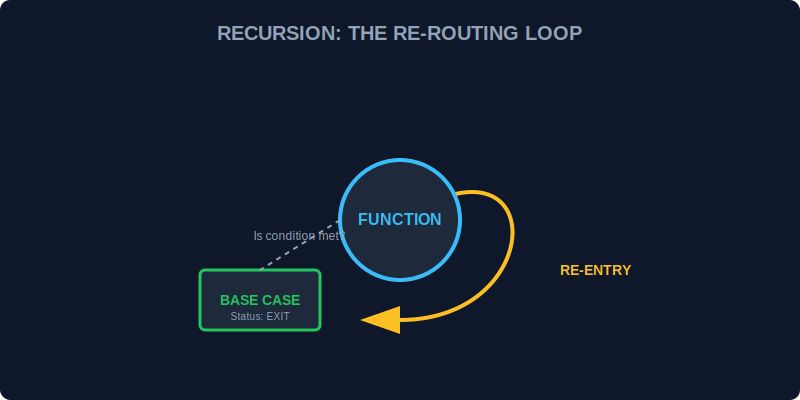

# CH-03: Recursion (The Re-routing Loop)

> **"Recursion adalah sirkuit yang mengarahkan energi kembali ke dirinya sendiri untuk menyelesaikan tugas yang berulang, hingga kondisi penghentian tercapai."**

Beberapa masalah dalam pemrograman (seperti menjelajahi struktur folder yang dalam) lebih mudah diselesaikan dengan fungsi yang memanggil dirinya sendiri daripada menggunakan loop biasa.

## 1. Mental Model: "The Re-routing Loop"

Bayangkan Anda berada di sebuah labirin Hub Energi. Anda membawa satu instruksi: "Jika Anda melihat pintu, masuklah dan cari kotak energi. Jika tidak ada lagi pintu, kembali ke ruangan sebelumnya."

Rekursi terdiri dari dua komponen vital:
1.  **Base Case (Titik Henti)**: Kondisi di mana sirkuit berhenti berputar (mencegah *Infinite Loop*).
2.  **Recursive Case (Langkah Berulang)**: Bagian di mana fungsi memanggil dirinya sendiri dengan input yang lebih kecil atau berbeda.



---

## 2. Struktur Dasar Rekursi

```javascript
function countdown(power) {
    // 1. Base Case
    if (power <= 0) {
        console.log("Energi Habis. Sirkuit Berhenti.");
        return;
    }
    
    // 2. Action
    console.log(`Sisa Energi: ${power}MW`);
    
    // 3. Recursive Case
    countdown(power - 10);
}

countdown(30);
```

---

## 3. Bahaya: Stack Overflow (Overload Sirkuit)

Setiap kali fungsi memanggil dirinya sendiri, JavaScript menumpuk instruksi tersebut di dalam **Call Stack**. Jika sirkuit berputar terlalu banyak tanpa mencapai *Base Case*, sirkuit akan meledak (Error: *Maximum call stack size exceeded*).

---

## Arsitek Mindset: Kapan Menggunakan Rekursi?

Sebagai arsitek, jangan gunakan rekursi hanya karena terlihat keren. Loop biasa (`for`/`while`) seringkali lebih efisien secara memori. Gunakan rekursi saat Anda berhadapan dengan struktur data yang bersarang (*nested data*) seperti pohon (*tree*) atau saat algoritma tersebut secara alami bersifat rekursif (seperti *Factorial* atau *Fibonacci*).

---

## Hands-on: Penelusuran Grid Kompleks
Buka file `examples/recursion_lab.js` untuk melihat bagaimana kita menggunakan rekursi untuk memindai seluruh sub-grid energi yang memiliki kedalaman tidak menentu.

---
*Status: [status.md](../../../status.md)*
