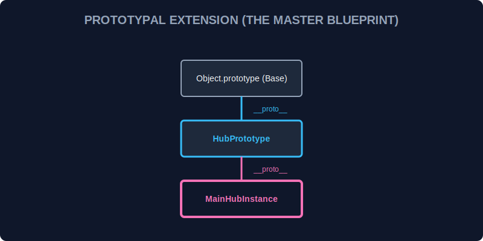

# CH-02: Advanced Prototypes (Blueprint Extensions)

> **"Pewarisan di JavaScript bukan tentang menyalin data dari induk ke anak, melainkan tentang membangun 'Ekstensi Cetak Biru' di mana objek anak dapat meminjam daya dari prototipenya."**

Kita sudah melihat dasar-dasar prototipe di SR-01-get-started-javascript/CH-01-get-started. Sekarang, kita akan melihat bagaimana cara memanipulasi rantai prototipe ini secara manual untuk membangun arsitektur sistem yang lebih kompleks.

## 1. Mental Model: "Blueprint Extensions"

Bayangkan Hub Energi memiliki model generator dasar (**Base Generator**). Anda ingin membangun **Solar Generator**. Daripada mendesain Solar Generator dari nol, Anda mengambil cetak biru Base Generator dan menambahkan panel surya di atasnya. Jika Solar Generator ditanya tentang "mesin", ia akan merujuk ke cetak biru Base Generator.



---

## 2. Membuat Objek dengan Prototipe Spesifik

Cara paling modern dan bersih untuk membuat objek dengan prototipe tertentu adalah menggunakan `Object.create()`.

```javascript
const energyBase = {
    type: "Generic",
    report: function() { console.log(`Type: ${this.type}`); }
};

const solarUnit = Object.create(energyBase);
solarUnit.type = "Solar";
solarUnit.report(); // Output: Type: Solar (metode report dipinjam dari energyBase)
```

---

## 3. Inspeksi dan Modifikasi Rantai (Chain)

Sebagai teknisi ahli, Anda bisa memeriksa dan mengubah koneksi prototipe saat runtime (meskipun mengubah prototipe secara langsung tidak disarankan demi performa).

- **`Object.getPrototypeOf(obj)`**: Melihat siapa "induk" dari objek ini.
- **`Object.setPrototypeOf(obj, proto)`**: Mengganti "induk" objek (Gunakan dengan sangat hati-hati!).

---

## 4. Properti Milik Sendiri vs Warisan

Hati-hati saat memindai properti objek. Beberapa properti mungkin ada di objek itu sendiri, sementara yang lain dipinjam dari prototipenya.

```javascript
console.log(solarUnit.hasOwnProperty('type'));   // true (karena kita set tadi)
console.log(solarUnit.hasOwnProperty('report')); // false (karena ini milik energyBase)
```

---

## Arsitek Mindset: Efisiensi Memori

Gunakan prototipe untuk menyimpan metode yang dibagikan oleh banyak objek. Jika Anda memiliki 1000 sensor, jangan buat 1000 fungsi `checkStatus` di dalam setiap objek. Letakkan di prototipe, sehingga 1000 sensor tersebut hanya merujuk ke **satu** lokasi memori yang sama. Ini meningkatkan efisiensi energi (memori) Hub Anda secara signifikan.

---

## Hands-on: Lab Rantai Prototipe
Buka file `examples/proto_lab.js` untuk mencoba membangun hierarki perangkat energi yang kompleks hanya dengan menggunakan `Object.create()`.

---
*Status: [status.md](../../../status.md)*
