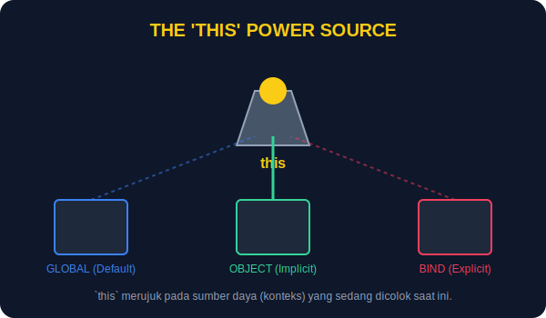

# CH-01: The `this` Keyword (The Current Power Source)

> **"Kata kunci `this` adalah referensi ke 'Sumber Daya' atau 'Konteks' yang sedang memberikan tenaga pada baris kode tersebut saat ini."**

`this` adalah salah satu konsep yang paling membingungkan karena nilainya tidak bersifat statis, melainkan bergantung pada **bagaimana** sebuah fungsi dipanggil.

## 1. Mental Model: "The Current Power Source"

Bayangkan sebuah lampu portabel. Lampu itu sendiri (`this`) tidak punya energi tetap.
- Jika dicolok ke **Dinding (Global)**, energinya dari Grid Nasional.
- Jika dicolok ke **Baterai (Object)**, energinya dari Baterai tersebut.
- Jika Anda **Memaksa Sambungan (Call/Bind)**, Anda bisa menentukan sendiri dari mana energinya berasal.



---

## 2. Empat Aturan Utama `this`

### A. Default Binding (Global Grid)
Jika fungsi dipanggil biasa, `this` merujuk ke Global Object (Window di browser).
```javascript
function showPower() {
    console.log(this); 
}
showPower(); // Window / Global
```

### B. Implicit Binding (Object Battery)
Jika fungsi dipanggil sebagai metode objek, `this` merujuk ke objek tersebut.
```javascript
const generator = {
    id: "G1",
    check: function() { console.log(this.id); }
};
generator.check(); // Output: G1
```

### C. Explicit Binding (Forced Connection)
Menggunakan `call`, `apply`, atau `bind` untuk memaksa `this` merujuk ke objek tertentu.
```javascript
function reportStatus() {
    console.log(`Status ${this.id}: Online`);
}
const subStation = { id: "S-09" };
reportStatus.call(subStation); // Forced to S-09
```

### D. New Binding (Constructor)
Saat menggunakan `new`, `this` merujuk ke objek baru yang sedang dibuat.

---

## 3. Arrow Function Catch
Ingat materi sebelumnya (BK-02 CH-02)? Arrow function **tidak punya `this` sendiri**. Ia selalu menggunakan `this` dari lingkungan tempat ia ditulis (Lexical).

---

## Arsitek Mindset: Memahami Arus Konteks

Sebagai arsitek, kesalahan dalam memahami `this` sering menyebabkan bug "undefined". Gunakan `.bind()` jika Anda ingin memastikan sebuah fungsi selalu memiliki sumber daya yang sama, terutama saat berhadapan dengan *Event Listeners* atau *Callbacks*.

---

## Hands-on: Pelacakan Sumber Daya
Buka file `examples/this_lab.js` untuk melihat bagaimana `this` berpindah-pindah sumber daya tergantung pada cara pemanggilannya.

---
*Status: [status.md](../../../status.md)*
