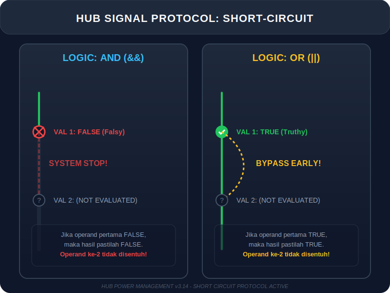

# CH-02: Logical Operators (Signal Combining)

> **"Satu sinyal saja jarang cukup untuk menyalakan reaktor utama. Kita butuh kombinasi sinyal dari berbagai sensor. Logical Operators adalah gerbang logika yang menentukan kapan aliran energi utama boleh dibuka."**

Operator logika biasanya digunakan dengan nilai Boolean, namun mereka juga bisa mengoperasikan nilai non-boolean (Short-circuiting).

## 1. Mental Model: "Signal Combining"

### `&&` (Logical AND) - Seri
Bayangkan dua saklar yang dipasang secara **Seri**. Energi hanya akan mengalir jika Saklar A **DAN** Saklar B diaktifkan.

### `||` (Logical OR) - Paralel
Bayangkan dua saklar yang dipasang secara **Paralel**. Energi akan mengalir jika Saklar A **ATAU** Saklar B (atau keduanya) diaktifkan.

### `!` (Logical NOT) - Inverter
Pembalik sinyal. Aktif menjadi Mati, Mati menjadi Aktif.

---

## 2. Short-circuit Evaluation (Pemutusan Arus Cepat)

Hub sangat efisien. Jika ia sudah tahu hasil akhirnya, ia akan berhenti memeriksa saklar lainnya.
- **AND (`&&`)**: Jika saklar pertama MATI (`false`), Hub berhenti. Hasil pasti mati.
- **OR (`||`)**: Jika saklar pertama AKTIF (`true`), Hub berhenti. Hasil pasti aktif.



```javascript
// Penggunaan praktis untuk nilai default
let userConfig = null;
let activeConfig = userConfig || "DEFAULT_ENERGY_LEVEL"; 
// Jika userConfig kosong (falsy), gunakan default.
```

---

## 3. Operator Nullish Coalescing (`??`)

Mirip dengan `||`, tapi lebih spesifik. Hanya akan berpindah ke jalur cadangan jika nilai utama adalah `null` atau `undefined` (benar-benar tidak ada data).

---

## Hands-on: Lab Penggabungan Sinyal
Buka file `examples/logical_lab.js` untuk mempelajari cara membangun gerbang logika kompleks dan memanfaatkan fitur short-circuit untuk efisiensi kode.

---
*Status: [status.md](../../../status.md)*
