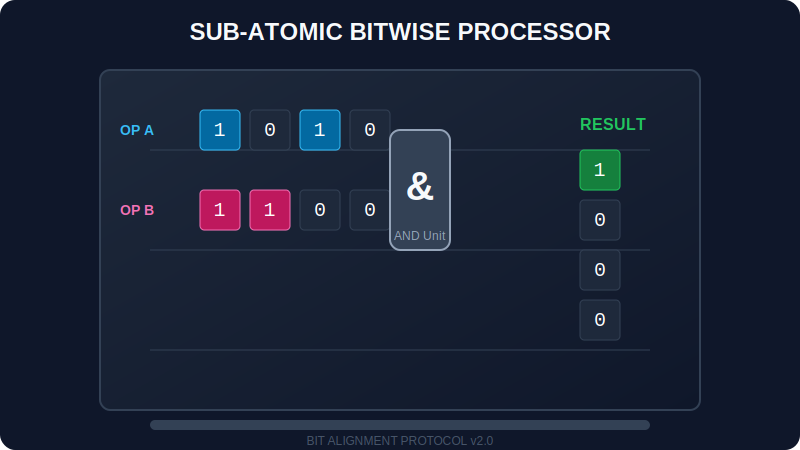

# CH-01: Bitwise Operators (Sub-atomic Control)

> **"Kado terbesar dari Hub Energi adalah kemampuan untuk memanipulasi energi pada level atom. Bitwise Operators memungkinkan Anda mengubah bit 0 dan 1 secara langsung, memberikan performa maksimal untuk operasi tingkat rendah."**

Operator bitwise memperlakukan operand mereka sebagai sekumpulan 32 bit (nol dan satu), bukan sebagai angka desimal biasa.

## 1. Mental Model: "Sub-atomic Control"

Bayangkan Anda memiliki panel dengan 32 saklar kecil. Setiap saklar hanya bisa posisi ON (1) atau OFF (0).

### Gerbang Logika Bit (Bitwise Logic)
- **`&` (AND)**: Hanya ON jika kedua saklar di posisi yang sama ON.
- **`|` (OR)**: ON jika salah satu saklar ON.
- **`^` (XOR)**: ON hanya jika saklar berbeda posisi (satu ON, satu OFF).
- **`~` (NOT)**: Membalikkan seluruh posisi saklar (Inverter).

### Pergeseran Muatan (Bitwise Shifting)
- **`<<` (Left Shift)**: Menggeser seluruh saklar ke kiri (mirip perkalian dengan 2).
- **`>>` (Right Shift)**: Menggeser ke kanan (mirip pembagian dengan 2).
- **`>>>` (Unsigned Right Shift)**: Menggeser ke kanan dengan mengisi 0 di paling kiri (mengabaikan tanda minus).

---

## 2. Kenapa Arsitek Menggunakannya?

Meskipun jarang digunakan di aplikasi web biasa, operator bitwise sangat krusial untuk:
- **Masking**: Mengaktifkan/menonaktifkan fitur tertentu menggunakan satu angka.
- **Performa Tinggi**: Perhitungan matematika yang jauh lebih cepat daripada fungsi `Math`.
- **Pengolahan Grafik & Game**: Di mana setiap bit sangat berharga.

---

## Arsitek Mindset: Batasan 32-Bit
Ingatlah bahwa JavaScript mengubah angka menjadi integer 32-bit bertanda (signed) sebelum melakukan operasi bitwise. Ini berarti angka yang sangat besar (di atas 2^31) mungkin akan berperilaku aneh karena bit tanda (sign bit).

---

## Hands-on: Lab Kontrol Sub-Atomik
Buka file `examples/bitwise_lab.js` untuk mencoba memanipulasi bit dan melihat bagaimana angka desimal direpresentasikan dalam bentuk biner di dalam sirkuit Hub.

---
*Status: [status.md](../../../status.md)*
