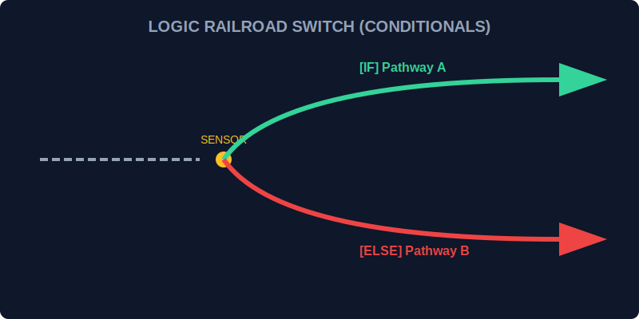

# CH-01: Conditionals (The Railroad Switches)

> **"Aliran energi di Hub tidak selalu lurus. Conditionals adalah 'Wesel Kereta Api' (Railroad Switches) yang mengarahkan arus logika ke jalur yang berbeda berdasarkan kondisi sensor saat itu."**

Dalam JavaScript, kita menggunakan pernyataan kondisional untuk membuat keputusan. Tanpa ini, program kita hanya akan berjalan satu arah tanpa kecerdasan.

## 1. Mental Model: "The Railroad Switch"

Bayangkan Hub Energi kita memiliki percabangan jalur. Sebelum arus lewat, ada sensor yang memeriksa kondisi:
- **`if`**: "Jika sensor A aktif, belok ke jalur 1."
- **`else`**: "Jika tidak, belok ke jalur default."
- **`else if`**: "Jika sensor A tidak aktif, tapi sensor B aktif, belok ke jalur 2."
- **`switch`**: "Pilih jalur berdasarkan kode identitas modul."



---

## 2. If...Else Statement (The Binary Switch)

Ini adalah bentuk percabangan paling dasar. Hanya ada dua kemungkinan utama (atau lebih dengan `else if`).

```javascript
const energyLevel = 75;

if (energyLevel > 90) {
    console.log("Status: OVERLOAD");
} else if (energyLevel > 50) {
    console.log("Status: STABLE");
} else {
    console.log("Status: LOW POWER");
}
```

**Analogi**: Sensor memeriksa tekanan uap. Jika terlalu tinggi, alihkan ke pembuangan; jika cukup, alihkan ke turbin.

---

## 3. Switch Statement (The Multi-Track Station)

Jika Anda memiliki banyak kondisi berdasarkan satu nilai yang sama, `switch` jauh lebih rapi daripada tumpukan `if...else`.

```javascript
const moduleType = "SOLAR";

switch (moduleType) {
    case "SOLAR":
        console.log("Protokol: Fotovoltaik Aktif");
        break;
    case "WIND":
        console.log("Protokol: Turbin Udara Aktif");
        break;
    default:
        console.log("Protokol: Mode Standby");
}
```

**PENTING**: Selalu gunakan `break` kecuali Anda sengaja ingin arus "tumpah" (*fall-through*) ke jalur berikutnya.

---

## Arsitek Mindset: Kapan Menggunakan Apa?

Sebagai arsitek sirkuit:
- Gunakan **`if`** untuk pengecekan kondisi logis yang kompleks (misal: `A && B || C`).
- Gunakan **`switch`** saat Anda membandingkan satu nilai terhadap banyak kemungkinan konstanta yang spesifik (seperti daftar ID atau tipe modul). 

---

## Hands-on: Lab Jalur Logika
Buka file `examples/conditionals_lab.js` untuk mensimulasikan sistem distribusi energi cerdas yang menggunakan `if` dan `switch` untuk mengelola berbagai skenario beban listrik.

---
*Status: [status.md](../../../status.md)*
