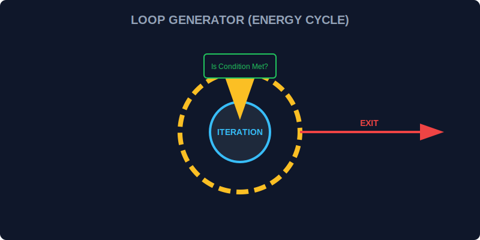

# CH-02: Loops (The Energy Cycles)

> **"Beberapa tugas di Hub Energi harus dilakukan berulang kali—seperti memutar turbin atau memindai ribuan sensor. Loops adalah 'Siklus Energi' yang menjaga proses tetap berjalan selama kondisi terpenuhi."**

Siklus pengulangan memungkinkan kita menjalankan blok kode yang sama berkali-kali tanpa menulisnya secara manual.

## 1. Mental Model: "The Energy Cycle"

Bayangkan sebuah turbin raksasa. Selama ada uap panas (kondisi), turbin akan terus berputar (iterasi). Segera setelah uap habis, turbin melambat dan berhenti.

- **`for`**: Putaran terukur (misal: putar 10 kali).
- **`while`**: Putaran selama kondisi aktif (putar selama uap ada).
- **`do...while`**: Putar dulu sekali, baru periksa uapnya.



---

## 2. For Loop (The Measured Cycle)

Gunakan `for` saat Anda tahu persis berapa kali atau sampai mana iterasi harus berjalan.

```javascript
for (let i = 1; i <= 5; i++) {
    console.log(`Memindai Sensor S-0${i}... OK`);
}
```

**Komponen**:
1.  **Inisialisasi**: Mulai dari angka berapa (let i = 1).
2.  **Kondisi**: Sampai kapan berputar (i <= 5).
3.  **Update**: Apa yang terjadi setelah satu putaran (i++).

---

## 3. While & Do...While (The Condition Cycle)

`while` digunakan saat jumlah putaran bergantung pada faktor luar yang dinamis.

```javascript
let fuelLevel = 50;

while (fuelLevel > 0) {
    console.log(`Mengeluarkan Energi. Sisa bahan bakar: ${fuelLevel}%`);
    fuelLevel -= 10;
}
```

**Perhatian**: `do...while` menjamin kode dijalankan **minimal satu kali**, karena pengecekan kondisi dilakukan di akhir putaran.

---

## Arsitek Mindset: Efisiensi Siklus

Sebagai arsitek Hub:
- Gunakan **`for`** untuk iterasi array atau koleksi yang ukurannya sudah diketahui.
- Hati-hati dengan **Infinite Loops** (Siklus Tanpa Henti) yang bisa menghanguskan CPU (Hub Overheat). Pastikan kondisi penghenti pasti tercapai!
- Gunakan **`break`** untuk melompat keluar dari siklus secara darurat jika kondisi tertentu terpenuhi sebelum waktunya.

---

## Hands-on: Simulator Turbin
Buka file `examples/loops_lab.js` untuk melihat bagaimana kita mengelola pemindaian sensor massal dan siklus pengisian daya menggunakan berbagai jenis loops.

---
*Status: [status.md](../../../status.md)*
