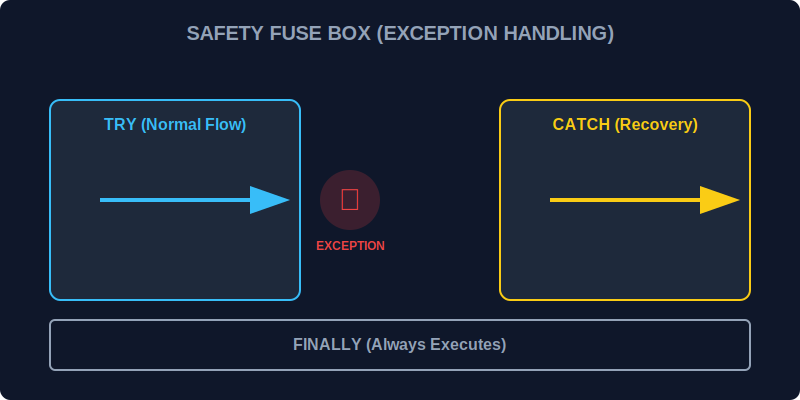

# CH-01: Exception Handling (The Safety Fuse Box)

> **"Kesalahan adalah hal yang tak terelakkan di Hub Energi yang kompleks. Exception Handling adalah 'Kotak Sekering' (Safety Fuse Box) yang mencegah seluruh sirkuit terbakar saat terjadi lonjakan arus (error) yang tak terduga."**

Exception handling memungkinkan kita untuk "menangkap" error saat mereka terjadi dan menanganinya secara elegan tanpa membuat aplikasi berhenti total.

## 1. Mental Model: "The Safety Fuse Box"

Bayangkan sirkuit energi Anda memiliki sekering pelindung:
- **`try`**: Bagian sirkuit tempat arus utama bekerja. Jika ada lonjakan, sekering akan putus.
- **`catch`**: Kotak penampung lonjakan. Di sini Anda melakukan prosedur pemulihan (misal: jalankan generator cadangan).
- **`finally`**: Tindakan pembersihan yang dilakukan **setiap saat**, tidak peduli apakah ada ledakan atau tidak (misal: menutup pintu lab).



---

## 2. Struktur Try-Catch-Finally

```javascript
try {
    // Alur kerja utama yang berisiko
    jalankanTurbinUtama();
} catch (error) {
    // Jalankan jika terjadi error di blok 'try'
    console.error("GANGGUAN TERDETEKSI:", error.message);
    jalankanTurbinCadangan();
} finally {
    // Selalu jalankan (Opsional)
    console.log("Membersihkan sisa-sisa uap di saluran.");
}
```

---

## 3. Mengapa Ini Penting?

Tanpa `try...catch`, sebuah error kecil di Hub (misal: variabel yang tidak ada) akan meruntuhkan seluruh sistem aplikasi. Di lingkungan asinkron atau saat berhadapan dengan data luar (API), ini adalah **Standard Operasi Prosedur (SOP)** yang wajib.

---

## Arsitek Mindset: Tangkap, Identifikasi, Pulihkan

Sebagai arsitek keamanan:
- **Jangan menangkap error secara diam-diam** (silent catch). Berikan log atau notifikasi yang jelas.
- Gunakan blok **`finally`** untuk menutup koneksi database, menghapus file temporer, atau melepaskan sumber daya memori lainnya agar tidak terjadi kebocoran (leakage).

---

## Hands-on: Simulasi Ledakan Sirkuit
Buka file `examples/safety_fuse_lab.js` untuk melihat bagaimana `try...catch` menyelamatkan Hub Energi dari kegagalan total saat terjadi lonjakan data palsu.

---
*Status: [status.md](../../../status.md)*
