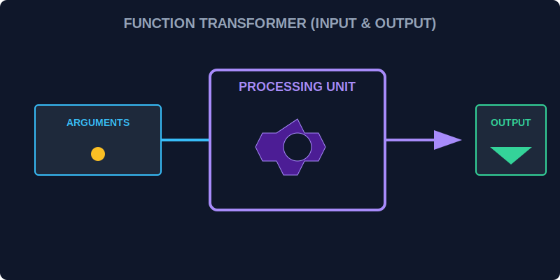

# CH-01: Default Parameters (Backup Fuel)

> **"Sebuah Transformer membutuhkan bahan bakar untuk bekerja. Namun, jika operator lupa mengirimkan bahan bakar, Default Parameters adalah 'Cadangan Bahan Bakar' (Backup Fuel) otomatis yang memastikan mesin tidak berhenti bekerja secara mendadak."**

Default parameters memungkinkan kita menginisialisasi parameter formal dengan nilai default jika tidak ada nilai atau `undefined` yang dikirimkan ke fungsi.

## 1. Mental Model: "The Backup Fuel"

Bayangkan sebuah mesin generator. Pengguna seharusnya memasukkan jenis bahan bakar (misal: "Bensin"). Namun, jika pengguna mengosongkan tangki input, mesin memiliki cadangan internal berlabel "Listrik" yang akan digunakan sebagai cadangan agar sistem tetap menyala.



---

## 2. Sintaksis Dasar

Sebelum ES6, kita harus melakukan pengecekan manual di dalam fungsi. Sekarang, kita bisa langsung menetapkannya di baris definisi.

```javascript
// Standar ES6+
function aktifkanTurbo(level = 10) {
    console.log(`Turbo diaktifkan pada level: ${level}`);
}

aktifkanTurbo(50); // Output: 50
aktifkanTurbo();   // Output: 10 (Menggunakan cadangan)
```

---

## 3. Evaluasi Waktu Panggil (Call-time Evaluation)

Nilai default tidak hanya berupa angka statis. Ia bisa berupa hasil dari ekspresi atau pemanggilan fungsi lain yang dievaluasi **setiap kali** fungsi dipanggil tanpa argumen.

```javascript
function getBasePower() { return 100; }

function supplyEnergy(amount = getBasePower()) {
    console.log(`Menyuplai ${amount}MW`);
}
```

---

## Arsitek Mindset: Ketahanan Sistem

Sebagai arsitek Hub:
- Gunakan default parameters untuk membuat fungsi Anda lebih tangguh (*robust*).
- Hindari ketergantungan pada pengecekan `if (param === undefined)` yang manual dan berulang.
- Letakkan parameter dengan nilai default di urutan paling akhir untuk memudahkan pemanggilan fungsi.

---

## Hands-on: Lab Cadangan Bahan Bakar
Buka file `examples/default_params_lab.js` untuk melihat bagaimana kita membangun fungsi konfigurasi modul yang tetap aman meskipun datanya tidak lengkap.

---
*Status: [status.md](../../../status.md)*
