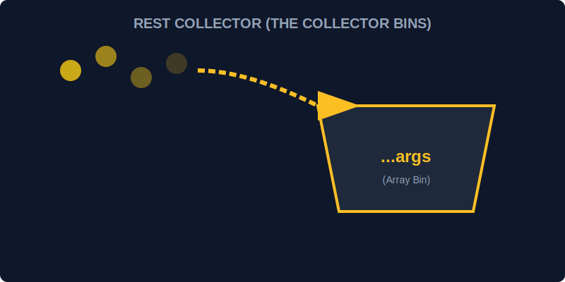

# CH-02: Rest Parameters (The Collector Bins)

> **"Terkadang, jumlah bahan bakar yang masuk tidak menentu. Rest Parameters adalah 'Wadah Penampung' (Collector Bins) yang menangkap seluruh sisa argumen tak terbatas ke dalam satu Array tunggal yang rapi."**

Sintaksis Rest parameter (`...`) memungkinkan kita merepresentasikan sejumlah argumen yang tidak terbatas sebagai sebuah array.

## 1. Mental Model: "The Collector Bins"

Bayangkan sebuah lini produksi. Anda memiliki slot untuk **Bahan Utama**, lalu di belakangnya ada keranjang raksasa berlabel **Lain-lain**. Berapa pun jumlah barang tambahan yang dilemparkan ke lini produksi, semuanya akan ditampung dengan rapi di dalam keranjang tersebut.



---

## 2. Cara Kerja Rest Parameter

Berbeda dengan objek `arguments` yang lama, Rest parameter benar-benar sebuah **Array asli**, sehingga Anda bisa langsung menggunakan metode seperti `map`, `filter`, atau `reduce`.

```javascript
function hitungTotalEnergi(idHub, ...daftarMuatan) {
    const total = daftarMuatan.reduce((acc, curr) => acc + curr, 0);
    console.log(`Hub ${idHub} memproses total: ${total}MW`);
}

hitungTotalEnergi("ALPHA", 10, 20, 30, 40); // daftarMuatan = [10, 20, 30, 40]
```

---

## 3. Aturan Main: "The Last One"

Rest parameter harus menjadi **parameter terakhir** dalam definisi fungsi. Anda tidak bisa meletakkan apa pun setelah keranjang penampung sisa.

---

## Arsitek Mindset: Fleksibilitas Tanpa Batas

Sebagai arsitek Hub:
- Gunakan Rest parameters saat membangun fungsi utilitas seperti Logger, Math Calculators, atau Event Dispatchers yang jumlah inputnya dinamis.
- Gunakan ini sebagai pengganti permanen untuk objek `arguments` karena Rest parameter lebih bersih, eksplisit, dan memiliki kekuatan penuh dari Array API.

---

## Hands-on: Lab Penampung Energi
Buka file `examples/rest_params_lab.js` untuk melihat bagaimana kita membangun fungsi penjumlah beban listrik yang fleksibel menggunakan keranjang penampung Rest.

---
*Status: [status.md](../../../status.md)*
