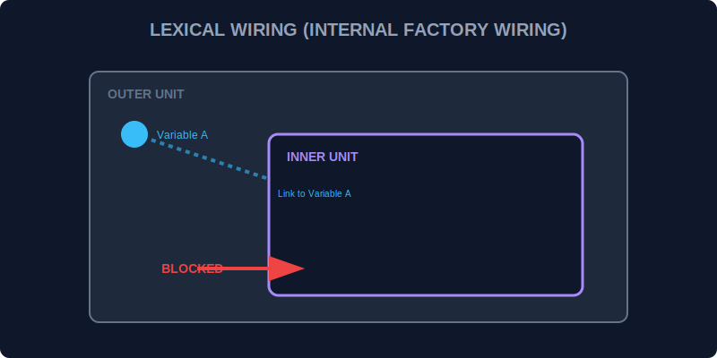

# CH-01: Lexical Scoping (Internal Factory Wiring)

> **"Di dalam Hub Energi, setiap unit pemrosesan memiliki 'Kabel Internal' (Internal Wiring). Aliran energi hanya bisa mengalir dari unit pusat ke unit cabang, bukan sebaliknya. Lexical Scoping adalah aturan yang menentukan jalur kabel tersebut berdasarkan tempat unit dipasang."**

Lexical Scoping menentukan jangkauan variabel berdasarkan lokasi fisiknya di dalam kode sumber.

## 1. Mental Model: "Internal Factory Wiring"

Bayangkan sebuah pabrik besar. Di dalam pabrik ada **Ruang Utama**. Di dalam ruang utama ada **Kotak Kontrol**.
- Operator di dalam **Kotak Kontrol** bisa menarik kabel ke **Ruang Utama** (akses variabel luar).
- Namun, operator di **Ruang Utama** tidak bisa melihat atau menarik kabel ke dalam **Kotak Kontrol** yang tertutup rapat (tidak punya akses ke variabel dalam).

Keputusan "siapa bisa akses siapa" dibuat saat unit dibangun (berdasarkan struktur teks kode), bukan saat unit dijalankan.



---

## 2. Rantai Scoping

JavaScript akan mencari variabel mulai dari lingkup paling dalam. Jika tidak ditemukan, ia akan naik satu tingkat ke luar, terus hingga ke tingkat Global.

```javascript
const globalEnergy = "Solar";

function outerUnit() {
    const unitEnergy = "Wind";

    function innerUnit() {
        console.log(`Menggunakan: ${globalEnergy} & ${unitEnergy}`);
    }
    
    innerUnit();
}
```

---

## 3. Static Nature

Ingat, Lexical Scope bersifat **statis**. Dimana fungsi tersebut dideklarasikan menentukan lingkup variabelnya, bukan dimana fungsi tersebut dipanggil.

---

## Arsitek Mindset: Desain Modular

Sebagai arsitek Hub:
- Manfaatkan Lexical Scoping untuk menyembunyikan detail teknis di dalam fungsi.
- Minimalkan variabel di tingkat Global agar tidak terjadi "Gangguan Arus" (Variable Collision) antar sirkuit.
- Pahami bahwa setiap fungsi baru yang Anda buat adalah "Kotak Kontrol" baru dengan jalur kabelnya sendiri.

---

## Hands-on: Lab Jalur Kabel
Buka file `examples/lexical_wiring_lab.js` untuk melihat bagaimana fungsi bersarang mengakses data dari lingkungan luarnya tanpa kebocoran data.

---
*Status: [status.md](../../../status.md)*
