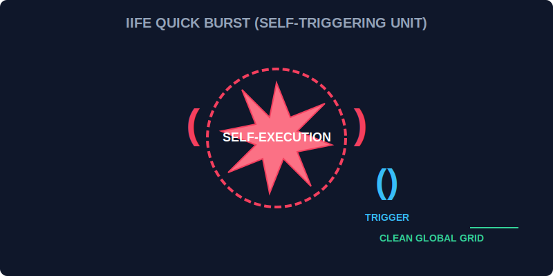

# CH-03: IIFE (The Quick Burst Units)

> **"Terkadang, Anda memerlukan ledakan energi sekali saja untuk inisialisasi awal tanpa ingin sisa residunya mengotori grid global. IIFE adalah 'Unit Ledakan Singkat' (Quick Burst) yang menyala, bekerja, dan langsung padam seketika."**

Immediately Invoked Function Expressions (IIFE) adalah fungsi yang segera dieksekusi setelah didefinisikan.

## 1. Mental Model: "The Quick Burst"

Bayangkan Hub memiliki tombol "Reset Global". Anda ingin tombol ini menyalakan sirkuit pembersih, membersihkan semua debu, lalu sirkuit tersebut menghilang agar tidak mengonsumsi daya lagi. IIFE dibungkus dalam kurung pelindung `()` dan langsung dipicu dengan `()`.



---

## 2. Sintaksis Dasar

```javascript
(function() {
    console.log("Inisialisasi Keamanan Hub... OK");
    const secretKey = "0x88-99"; // Tidak akan bocor ke global
})();
```

---

## 3. Kegunaan Utama: Enkapsulasi

Salah satu alasan terbesar menggunakan IIFE adalah untuk **menghindari polusi grid global**. Variabel apa pun yang dideklarasikan di dalam IIFE tidak akan bisa diakses dari luar, seolah-olah sirkuit tersebut berada di dalam ruang isolasi yang rapat.

*Catatan: Meskipun ES6 Modules kini lebih sering digunakan untuk isolasi, IIFE tetap menjadi pola yang kuat untuk inisialisasi script mandiri.*

---

## Arsitek Mindset: Bersihkan Jalur Grid

Sebagai arsitek Hub:
- Gunakan IIFE untuk tugas "sekali jalan" seperti menyiapkan konfigurasi awal atau menghubungkan sirkuit pihak ketiga agar tidak merusak variabel global Anda.
- Selalu awali IIFE dengan titik koma `;` jika sebelumnya ada baris kode lain, untuk menghindari kesalahan penggabungan sirkuit secara otomatis oleh sistem (ASI).

---

## Hands-on: Lab Ledakan Inisialisasi
Buka file `examples/iife_burst_lab.js` untuk melihat bagaimana kita mengisolasi kunci rahasia Hub menggunakan pola IIFE agar tidak bisa diintip dari luar.

---
*Status: [status.md](../../../status.md)*
