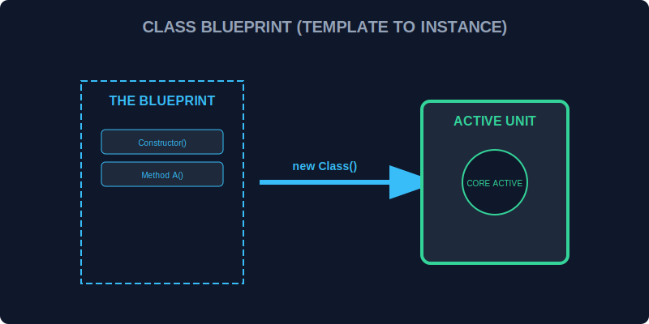

# CH-01: Class Declarations (The Master Blueprint)

> **"Membangun satu unit energi secara manual mungkin mudah. Namun, untuk membangun ribuan unit yang identik, Anda membutuhkan 'Cetak Biru Utama' (Master Blueprint). Class Declarations adalah standar industri yang merangkum seluruh spesifikasi unit dalam satu dokumen tunggal."**

Class di JavaScript bukanlah tipe data baru, melainkan "Gula Sintaksis" (*Syntactic Sugar*) di atas sistem prototipe yang sudah ada, dirancang agar lebih mudah dibaca dan dikelola.

## 1. Mental Model: "The Master Blueprint"

Bayangkan Anda adalah arsitek Hub. Alih-alih menggambar setiap generator satu per satu, Anda membuat satu blueprint pusat bertajuk `class Generator`. Blueprint ini berisi:
- Apa saja bagian-bagiannya (Properti).
- Apa saja yang bisa dilakukannya (Metode).
- Bagaimana cara merakitnya saat pertama kali dipesan (Constructor).



---

## 2. Sintaksis Dasar

```javascript
class EnergyUnit {
    // Blueprint untuk unit energi
}

// Membuat instansi (Physical Unit) dari blueprint
const unit01 = new EnergyUnit();
```

---

## 3. Class vs Constructor Function

Meskipun di balik layar menggunakan prototipe, `class` memberikan struktur yang jauh lebih bersih:
- Selalu berjalan dalam **Strict Mode**.
- Tidak bisa dipanggil tanpa kata kunci `new`.
- Metode di dalamnya tidak bisa diiterasi (*non-enumerable*) secara default, menjaga sirkuit tetap bersih.

---

## Arsitek Mindset: Standarisasi Unit

Sebagai arsitek Hub:
- Gunakan `class` untuk entitas yang memiliki banyak kemiripan dan membutuhkan cetak biru yang rapi.
- Hindari penggunaan fungsi konstruktor lama jika Anda sedang membangun infrastruktur modern.
- Pastikan nama class menggunakan **PascalCase** (misal: `SmartGrid`) untuk membedakannya dengan unit pemrosesan biasa (fungsi).

---

## Hands-on: Lab Cetak Biru Utama
Buka file `examples/class_basics_lab.js` untuk melihat bagaimana kita mendefinisikan dan merakit unit energi pertama kita menggunakan cetak biru `class`.

---
*Status: [status.md](../../../status.md)*
