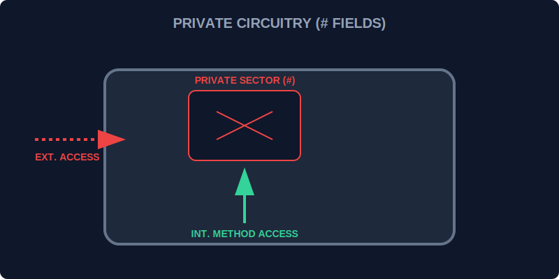

# CH-01: Private Fields (Internal Circuitry)

> **"Tidak semua bagian dari Hub Energi boleh disentuh oleh operator luar. Beberapa kabel sangat berbahaya dan sensitif. Private Fields adalah 'Sirkuit Internal' (Internal Circuitry) yang dikunci rapat menggunakan simbol `#`, memastikan tidak ada gangguan dari luar yang bisa merusak logika inti unit."**

Private field (misal `#field`) adalah fitur modern JavaScript yang memungkinkan kita membuat properti yang benar-benar tidak bisa diakses dari luar lingkup class tersebut.

## 1. Mental Model: "Internal Circuitry"

Bayangkan sebuah panel kontrol. Di bagian depan ada tombol-tombol publik. Namun, untuk melihat kabel-kabel di dalamnya, Anda harus membongkar casing besi yang terkunci. Simbol `#` adalah casing besi tersebut. Hanya teknisi yang berada **di dalam** blueprint yang bisa menyentuh kabel-kabel ini.



---

## 2. Menggunakan Simbol `#`

Untuk membuat properti menjadi private, Anda harus mendeklarasikannya di tingkat atas class diawali dengan tanda `#`.

```javascript
class NuclearReactor {
    #coreTemp = 500; // Sirkuit Internal (Private)

    checkSafety() {
        // Hanya bisa diakses dari dalam sini
        if (this.#coreTemp > 1000) return "DANGER";
        return "SAFE";
    }
}

const reactor = new NuclearReactor();
// console.log(reactor.#coreTemp); // ERROR! Sirkuit terisolasi.
```

---

## 3. Mengapa Menggunakan Private?

- **Keamanan Data**: Mencegah pihak luar memodifikasi data penting secara sembarangan.
- **Abstraksi**: Pengguna unit tidak perlu tahu kerumitan kabel internal, mereka cukup menggunakan tombol publik yang tersedia.
- **Stabilitas**: Anda bisa mengubah kabel internal tanpa merusak cara orang lain menggunakan unit tersebut.

---

## Arsitek Mindset: Prinsip Enkapsulasi

Sebagai arsitek Hub:
- Selalu buat properti menjadi **Private** secara default. Berikan akses publik hanya pada bagian yang benar-benar dibutuhkan.
- Gunakan private fields untuk menyimpan state internal yang butuh validasi ketat (misal: saldo energi).
- Ingat bahwa enkapsulasi adalah fondasi dari sistem yang kuat dan mudah dipelihara.

---

## Hands-on: Lab Sirkuit Terisolasi
Buka file `examples/private_circuit_lab.js` untuk melihat bagaimana kita melindungi inti energi dari akses ilegal menggunakan proteksi sirkuit `#`.

---
*Status: [status.md](../../../status.md)*
