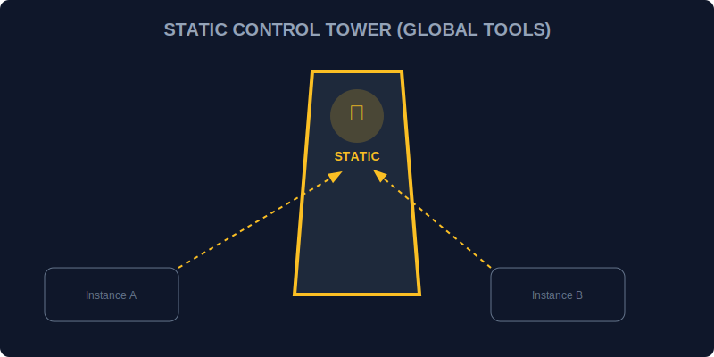

# CH-02: Static Members (Control Tower Tools)

> **"Beberapa alat di Hub tidak menempel pada unit generator individu. Alat-alat ini berada di 'Menara Kontrol' (Control Tower) dan bisa digunakan oleh semua orang tanpa perlu membangun unit baru. Static Members adalah peralatan markas yang bersifat global bagi seluruh class."**

Member `static` (metode atau properti) adalah member yang dimiliki oleh Class itu sendiri, bukan oleh instansi (objek) yang dibuat dari class tersebut.

## 1. Mental Model: "Control Tower Tools"

Bayangkan sebuah pabrik mobil.
- **Instance Method**: Klakson mobil (setiap mobil punya klakson sendiri).
- **Static Method**: Mesin Derek Pabrik (hanya ada satu di pabrik, digunakan untuk memindahkan mobil apa pun, tapi bukan bagian dari mobil itu sendiri).



---

## 2. Definisi Static

```javascript
class PowerOptimizer {
    static VERSION = "1.0.4"; // Properti Statis

    static calculateEfficiency(input, output) { // Metode Statis
        return (output / input) * 100;
    }
}

// Cara Panggil: Langsung lewat nama Class
console.log(PowerOptimizer.VERSION);
console.log(PowerOptimizer.calculateEfficiency(100, 85));
```

---

## 3. Kegunaan Utama

- **Utility Functions**: Fungsi pembantu yang tidak membutuhkan data internal dari unit individu.
- **Global Config**: Menyimpan konstanta atau pengaturan yang seragam untuk seluruh model unit sejenis.
- **Cache**: Menyimpan data yang dibagikan oleh seluruh instansi.

---

## Arsitek Mindset: Peralatan Bersama

Sebagai arsitek Hub:
- Gunakan `static` untuk logika yang bersifat umum dan tidak bergantung pada kondisi (*state*) spesifik dari satu unit.
- Ingat bahwa di dalam metode `static`, kata kunci `this` merujuk pada **Class** itu sendiri, bukan instansi objek.
- Member `static` sangat berguna untuk membangun pola *Factory* (unit pembuatan unit lain).

---

## Hands-on: Lab Menara Kontrol
Buka file `examples/control_tower_lab.js` untuk mencoba berbagai peralatan global yang disediakan langsung oleh menara kontrol tanpa perlu merakit unit baru.

---
*Status: [status.md](../../../status.md)*
