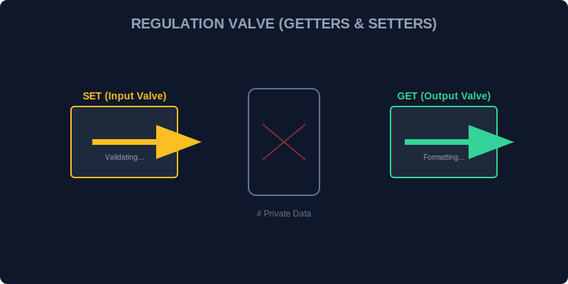

# CH-03: Getters & Setters (Regulation Valves)

> **"Arus energi yang masuk ke unit tidak boleh sembarangan. Terlalu tinggi bisa meledak, terlalu rendah tidak berguna. Getters & Setters adalah 'Katup Regulator' (Regulation Valves) yang menyaring dan memvalidasi arus informasi sebelum benar-benar menyentuh sirkuit internal."**

Accessor properties (`get` dan `set`) memungkinkan kita menjalankan kode saat properti diakses atau diubah, seolah-olah mereka adalah properti biasa.

## 1. Mental Model: "Regulation Valves"

Bayangkan tangki bahan bakar:
- **Getter**: Alat baca tekanan yang menunjukkan berapa sisa isi tangki dalam format yang mudah dibaca (misal: "FULL", "EMPTY").
- **Setter**: Katup pengisian yang menyaring kotoran. Jika Anda mencoba memasukkan batu (data sampah), katup ini akan menutup otomatis.



---

## 2. Implementasi Get & Set

Sangat disarankan untuk memasangkan Getters/Setters dengan **Private Fields** agar sirkuit internal benar-benar terlindungi.

```javascript
class FuelTank {
    #liters = 0;

    get volume() {
        return `${this.#liters} L`;
    }

    set volume(value) {
        if (value < 0) {
            console.error("Volume tidak boleh negatif!");
            return;
        }
        this.#liters = value;
    }
}

const tank = new FuelTank();
tank.volume = 100; // Memanggil Setter
console.log(tank.volume); // Memanggil Getter -> "100 L"
```

---

## 3. Keuntungan Utama

- **Validasi Otomatis**: Memastikan data selalu dalam format yang benar.
- **Derived Properties**: Memberikan data hasil kalkulasi (misal: `fullName` dari `firstName` + `lastName`).
- **Encapsulation**: Menyembunyikan kompleksitas penyimpanan data di balik antarmuka yang sederhana.

---

## Arsitek Mindset: Keamanan Berlapis

Sebagai arsitek Hub:
- Gunakan **Setters** untuk mencegah data sampah masuk ke sistem inti.
- Gunakan **Getters** untuk memformat data yang akan dilaporkan ke pengguna agar seragam.
- Jangan meletakkan logika yang terlalu berat atau asinkron di dalam accessor, karena akan membuat akses properti terasa lambat.

---

## Hands-on: Lab Katup Regulator
Buka file `examples/valve_lab.js` untuk melihat bagaimana kita mengatur suhu dan tekanan unit menggunakan katup keamanan yang cerdas.

---
*Status: [status.md](../../../status.md)*
