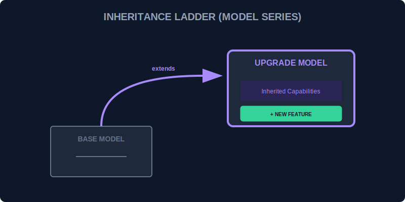

# CH-01: Extends (Model Series)

> **"Anda tidak perlu mendesain unit dari nol setiap kali ada kebutuhan baru. Cukup ambil Model Dasar yang sudah stabil dan lakukan 'Upgrade Model' (Model Series). Kata kunci `extends` memungkinkan model baru mewarisi seluruh kemampuan model lama sambil menambahkan fitur-fitur uniknya sendiri."**

Pewarisan (*inheritance*) dalam JavaScript memungkinkan sebuah class untuk mewarisi properti dan metode dari class lain.

## 1. Mental Model: "Model Series"

Bayangkan Hub memiliki **Model Dasar** (`BaseUnit`) yang memiliki kemampuan standar seperti `recharge()` dan `statusReport()`.
- Untuk membuat **Model Turbo**, Anda tidak menyalin desain `BaseUnit`.
- Anda cukup membuat `class TurboUnit extends BaseUnit`.
- `TurboUnit` secara otomatis memiliki semua kemampuan `BaseUnit`, plus kemampuan `boostMode()` sendiri.



---

## 2. Sintaksis Extends

```javascript
class BaseUnit {
    constructor(id) { this.id = id; }
    powerOn() { console.log(`${this.id} is ON`); }
}

// Mewarisi kemampuan BaseUnit
class SpecializedUnit extends BaseUnit {
    processData() { console.log(`${this.id} processing...`); }
}

const unit01 = new SpecializedUnit("SP-01");
unit01.powerOn(); // OK (Mewarisi)
unit01.processData(); // OK (Lokal)
```

---

## 3. Rantai Prototype

Di balik layar, `extends` menghubungkan prototype `SpecializedUnit` ke `BaseUnit`. Ini menciptakan rujukan hierarkis yang rapi di dalam memori Hub.

---

## Arsitek Mindset: Hierarki yang Sehat

Sebagai arsitek Hub:
- Gunakan pewarisan untuk menghindari pengulangan kode (*Don't Repeat Yourself*).
- Pertahankan hierarki yang dangkal. Terlalu banyak tingkat pewarisan (Base -> A -> B -> C -> D) akan membuat jalur logika sulit dilacak (seperti kabel yang terlalu panjang).
- Pastikan hubungan antar class adalah "is-a" (TurboUnit adalah sebuah BaseUnit).

---

## Hands-on: Lab Seri Model
Buka file `examples/model_series_lab.js` untuk melihat bagaimana kita membangun unit pemroses data khusus yang dikembangkan dari unit energi dasar.

---
*Status: [status.md](../../../status.md)*
