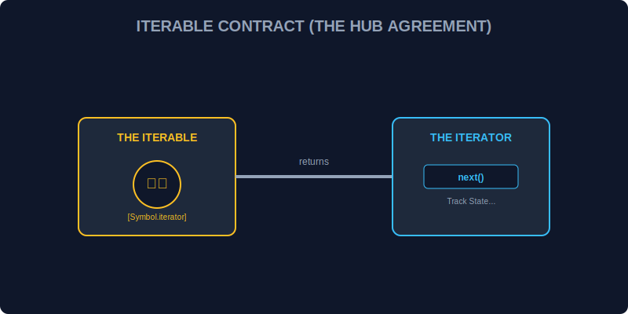

# CH-01: The Iterable Protocol (The Standard Track)

> **"Di dalam Hub, energi tidak selalu dilepaskan sekaligus. Seringkali, energi harus mengalir melalui 'Jalur Standar' (Standard Track) yang memungkinkan data diambil satu per satu secara teratur. Iterable Protocol adalah kontrak yang menentukan apakah suatu objek boleh masuk ke jalur ini."**

Iterable protocol memungkinkan objek JavaScript untuk mendefinisikan atau menyesuaikan perilaku iterasi mereka.

## 1. Mental Model: "The Standard Track"

Bayangkan sebuah gudang penyimpanan data. Agar data di gudang tersebut bisa dipindahkan menggunakan ban berjalan (conveyor), gudang tersebut harus memiliki pintu keluar khusus berlabel `Symbol.iterator`. Jika pintu ini ada, maka objek tersebut dianggap "Iterable" dan siap untuk diproses secara berurutan.

---

## 2. Syarat Menjadi Iterable

Sebuah objek menjadi iterable jika ia memiliki properti dengan kunci `[Symbol.iterator]`. Properti ini harus berupa fungsi yang mengembalikan sebuah **Iterator**.

Objek bawaan yang sudah memiliki pintu ini secara default:
- **Arrays**
- **Strings**
- **Maps & Sets**
- **Arguments Object**

---

## 3. Mengapa Menggunakan Protocol?

Protocol ini memberikan standarisasi. Selama sebuah objek mengikuti aturan "Standard Track", maka ia bisa digunakan dengan berbagai alat otomatis di JavaScript seperti:
- Loop `for...of`
- Spread Operator `[...]`
- Destructuring `[a, b] = iterable`
- `Array.from()`

---

## Arsitek Mindset: Standarisasi Aliran

Sebagai arsitek Hub:
- Gunakan iterable protocol untuk membuat struktur data kustom Anda menjadi "transparan" bagi alat-alat bawaan JavaScript.
- Identifikasi kapan sebuah objek butuh aliran berurutan daripada akses acak (*random access*).
- Hindari membuat pintu `Symbol.iterator` pada objek yang secara logis tidak mewakili sebuah urutan atau koleksi.

---

## Hands-on: Lab Jalur Standar
Buka file `examples/iterable_check_lab.js` untuk melihat bagaimana kita memverifikasi apakah suatu unit data memiliki pintu `Symbol.iterator` dan siap masuk ke jalur produksi.

---
*Status: [status.md](../../../status.md)*
