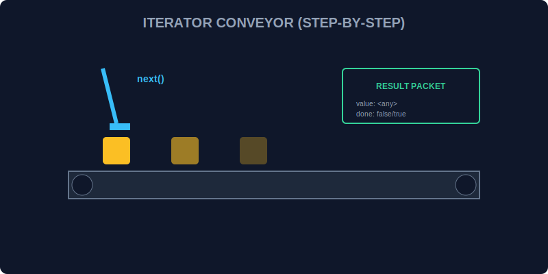

# CH-02: The Iterator Protocol (The Moving Unit)

> **"Jika Iterable adalah jalurnya, maka Iterator adalah 'Unit Penggerak' (The Moving Unit) itu sendiri. Ia tahu posisi data saat ini dan tahu bagaimana cara melompat ke posisi berikutnya sampai seluruh energi tersalurkan."**

Iterator protocol mendefinisikan cara standar untuk menghasilkan urutan nilai.

## 1. Mental Model: "The Moving Unit"

Bayangkan sebuah robot di atas ban berjalan.
1. Robot ini memiliki satu tombol utama: `next()`.
2. Setiap kali tombol ditekan, robot akan memberikan satu kotak paket data.
3. Paket tersebut berisi dua informasi:
   - `value`: Isi energinya.
   - `done`: Laporan apakah ini kotak terakhir (`true`) atau masih ada lagi (`false`).



---

## 2. Struktur Objek Iterator

Sebuah objek dianggap sebagai iterator jika ia mengimplementasikan metode `next()` dengan aturan berikut:

```javascript
const myIterator = {
    next: function() {
        return {
            value: "Energy Data",
            done: false
        };
    }
};
```

---

## 3. Statefulness (Penyimpanan Kondisi)

Iterator bersifat *stateful*. Ia mengingat di mana ia berhenti. Begitu `done: true` tercapai, iterator tersebut biasanya sudah "habis" (exhausted) dan tidak bisa digunakan lagi kecuali Anda membuat unit penggerak yang baru.

---

## Arsitek Mindset: Kendali Langkah demi Langkah

Sebagai arsitek Hub:
- Gunakan iterator manual jika Anda butuh kontrol yang sangat presisi atas kapan nilai berikutnya diambil (misal: memproses data besar secara perlahan agar tidak menghanguskan memori).
- Ingat bahwa setiap pemanggilan `next()` adalah operasi sinkron.
- Pahami bahwa iterator adalah fondasi dari fitur yang lebih canggih seperti **Generators**.

---

## Hands-on: Lab Unit Penggerak
Buka file `examples/manual_iterator_lab.js` untuk melihat bagaimana kita menggerakkan aliran data secara manual menggunakan metode `next()`.

---
*Status: [status.md](../../../status.md)*
