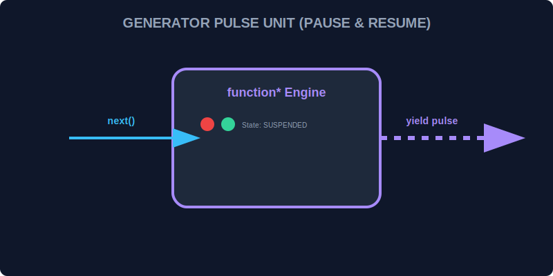

# CH-01: Generator Functions (The Pulse Origin)

> **"Jika fungsi biasa adalah ledakan daya yang harus selesai dalam satu waktu, Generator adalah 'Pusat Generator' (Pulse Generators) yang bisa dinyalakan, dihentikan sementara, dan dilanjutkan kembali sesuka hati. Mereka tidak menghasilkan output sekaligus, melainkan menghasilkan denyut-denyut (Pulses) nilai."**

Generator functions ditandai dengan sintaksis `function*` dan mengembalikan sebuah objek **Generator**.

## 1. Mental Model: "The Pulse Generator"

Bayangkan sebuah mesin generator di Hub. Anda menekan tombol "Start". Mesin mulai bekerja, namun kemudian mencapai titik `yield` dan berhenti. Daya tetap tersimpan, kondisi mesin (variabel lokal) tetap terjaga. Saat Anda menekan "Resume" (`next()`), mesin melanjutkan tepat dari posisi ia berhenti bekerja.



---

## 2. Sintaksis Dasar

```javascript
function* powerGenerator() {
    console.log("Fase 1: Mulai Aliran");
    yield 100;
    console.log("Fase 2: Aliran Lanjut");
    yield 200;
}

const gen = powerGenerator(); // Belum ada kode yang berjalan!
```

---

## 3. Keunggulan Unik

- **Execution Pausing**: Kemampuan untuk menghentikan fungsi di tengah-tengah.
- **Lazy Evaluation**: Menghasilkan nilai hanya saat diminta, sangat efisien untuk deret data tak terhingga.
- **Dual Communication**: Generator bisa menerima input kembali melalui `next(input)` saat sedang diactivasi ulang.

---

## Arsitek Mindset: Manajemen Arus terkendali

Sebagai arsitek Hub:
- Gunakan Generator untuk alur kerja yang membutuhkan banyak tahapan atau persetujuan di tengah jalan.
- Gunakan Generator untuk mensimulasikan deret data matematis yang sangat panjang tanpa memenuhi memori fisik Hub.
- Pahami bahwa Generator adalah Iterable sekaligus Iterator secara otomatis.

---

## Hands-on: Lab Pusat Generator
Buka file `examples/pulse_gen_lab.js` untuk melihat bagaimana kita mengontrol ritme kerja mesin generator menggunakan perintah `yield`.

---
*Status: [status.md](../../../status.md)*
