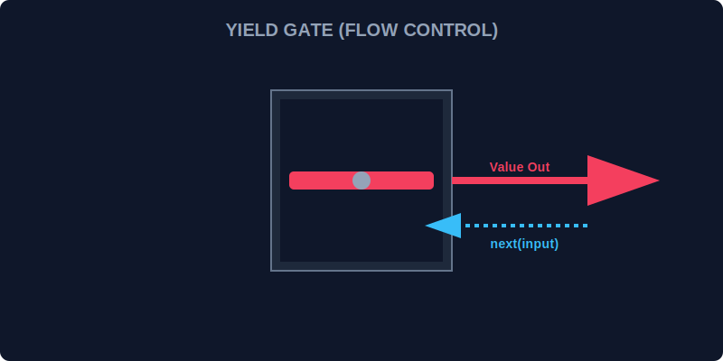

# CH-02: The yield Keyword (Yield Gate)

> **"Generator hanyalah sebuah mesin statis tanpa adanya 'Gerbang Kontrol' (Yield Gate). Kata kunci `yield` adalah gerbang yang tidak hanya mengeluarkan energi, tapi juga bisa menerima masukan kembali dari luar untuk menyesuaikan ritme kerja unit."**

`yield` adalah jeda dua arah yang sangat kuat dalam fungsi generator.

## 1. Mental Model: "The Yield Gate"

Bayangkan sebuah gerbang di bendungan.
1. Saat gerbang dibuka (`yield energy`), aliran air keluar menuju konsumen.
2. Gerbang kemudian menutup dan menunggu instruksi berikutnya.
3. Yang menarik, operator Hub bisa melemparkan pesan ke dalam gerbang tersebut saat dibuka kembali (`let feedback = yield energy`). Pesan ini bisa digunakan oleh mesin internal untuk mengubah tekanan air.



---

## 2. Pengiriman & Penerimaan Data

`yield` berfungsi ganda:
- **Output**: Mengirimkan nilai ke pemanggil `next()`.
- **Input**: Menangkap nilai yang dikirimkan balik melalui `next(value)`.

```javascript
function* interactiveUnit() {
    const input = yield "Checking current status...";
    console.log(`Menerima feedback dari Hub: ${input}`);
}

const unit = interactiveUnit();
console.log(unit.next().value); // "Checking current status..."
unit.next("SYSTEM-OK"); // Menyuntikkan data balik
```

---

## 3. Titik Penahanan (Suspension Points)

Setiap kata kunci `yield` menciptakan titik penahanan di mana fungsi tersebut "dibekukan" tanpa memakan sumber daya CPU secara aktif. Ini memungkinkan Hub menjalankan jutaan generator yang sedang menunggu tanpa membebani sistem secara keseluruhan.

---

## Arsitek Mindset: Komunikasi Dua Arah

Sebagai arsitek Hub:
- Gunakan `yield` untuk alur kerja yang bersifat interaktif (user input, middleware).
- Pastikan Anda memanggil `next()` pertama kali tanpa argumen, karena argumen pertama pada `next()` setelah inisialisasi akan diabaikan oleh generator (karena tidak ada `yield` yang menunggu).

---

## Hands-on: Lab Gerbang Kontrol
Buka file `examples/yield_flow_lab.js` untuk mencoba berkomunikasi dua arah dengan mesin generator melalui gerbang `yield`.

---
*Status: [status.md](../../../status.md)*
