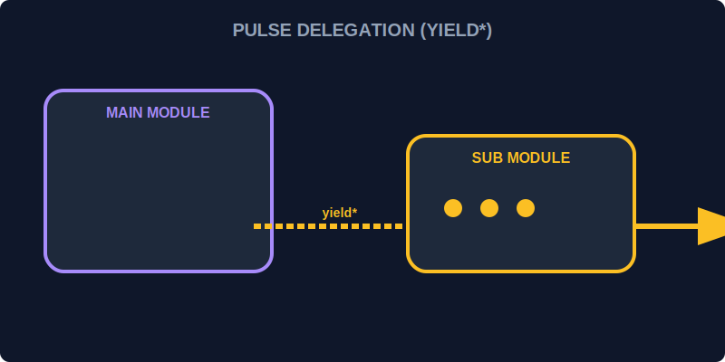

# CH-03: yield* (Pulse Delegation)

> **"Terkadang, sebuah generator utama tidak perlu memproses semua energi sendiri. Ia bisa mengalihkan aliran tugas ke generator pembantu lainnya. `yield*` adalah 'Kabel Delegasi' (Pulse Delegation) yang menyambungkan aliran dari generator satu langsung ke generator lainnya."**

Ekspresi `yield*` digunakan untuk mendelegasikan iterasi ke objek iterable lain (seringkali generator lain).

## 1. Mental Model: "Pulse Delegation"

Bayangkan Hub memiliki **Generator Induk** yang mengelola seluruh Grid. Saat tiba waktunya untuk memproses Sektor A, ia tidak menulis seluruh logika Sektor A di dalamnya. Ia menggunakan `yield* sectorAGenerator()` yang seolah-olah menyambungkan ban berjalan Sektor A langsung ke jalur utama Hub.



---

## 2. Sintaksis Delegasi

```javascript
function* subProcess() {
    yield "Sub-Task 1";
    yield "Sub-Task 2";
}

function* mainProcess() {
    yield "Main Task Start";
    yield* subProcess(); // Mendelegasikan ke subProcess
    yield "Main Task End";
}
```

---

## 3. Flattening Levels (Meratakan Aliran)

`yield*` secara otomatis membongkar (*unwrapping*) seluruh nilai dari iterable target. Jika targetnya adalah array, ia akan melakukan `yield` pada setiap elemen array tersebut satu per satu. Ini sangat berguna untuk menjaga keteraturan dan struktur kode Generator agar tetap ramping sembari menangani proses bercabang yang kompleks.

---

## Arsitek Mindset: Struktur Modular

Sebagai arsitek Hub:
- Gunakan `yield*` untuk memecah prosedur generator yang sangat panjang menjadi beberapa potongan kecil yang lebih mudah dikelola.
- Pahami bahwa delegasi ini juga meneruskan pengembalian nilai (*return value*) dari generator pembantu kembali ke generator utama.

---

## Hands-on: Lab Kabel Delegasi
Buka file `examples/delegation_lab.js` untuk melihat bagaimana sistem koordinasi Hub mendelegasikan tugas pembersihan energi ke beberapa generator sub-sektor secara otomatis.

---
*Status: [status.md](../../../status.md)*
