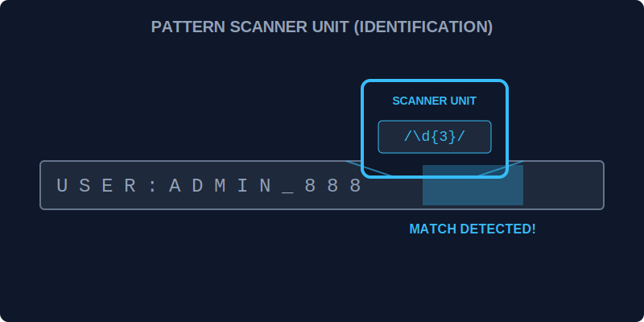

# CH-01: Literal vs Constructor (Scanner Models)

> **"Di Hub Energi, Anda bisa menggunakan pemindai portabel yang sudah diset sebelumnya (Literal) atau merakit pemindai kustom secara dinamis (Constructor). Mengetahui model scanner mana yang harus digunakan adalah langkah awal untuk mengenali tanda tangan data."**

JavaScript menyediakan dua cara untuk membuat objek Regular Expression.

## 1. Mental Model: "Scanner Models"

- **RegExp Literal (The Preset Scanner)**: Seperti alat pemindai yang sudah memiliki pola tetap di dalamnya. Ia cepat, efisien, dan dikompilasi saat skrip dimuat. Gunakan jika pola Anda tidak pernah berubah.
- **RegExp Constructor (The Dynamic Assembly)**: Seperti merakit pemindai di lapangan berdasarkan data yang baru diterima. Sedikit lebih lambat karena dikompilasi saat runtime, namun sangat fleksibel.



---

## 2. Perbandingan Sintaksis

```javascript
/* PRESET (Literal) */
const scannerA = /energy/i; 

/* DYNAMIC (Constructor) */
const pattern = "energy";
const flags = "i";
const scannerB = new RegExp(pattern, flags);
```

---

## 3. Karakteristik Kompilasi

- **Literal**: Dikompilasi sekali saja saat skrip dievaluasi. Sangat disarankan untuk performa tinggi di dalam loop.
- **Constructor**: Memungkinkan penggunaan variabel di dalam pola. Berguna jika Anda menerima input pencarian dari unit lain (misal: input user).

---

## Arsitek Mindset: Pilih Model yang Tepat

Sebagai arsitek Hub:
- Gunakan **Literal** (`/.../`) untuk 90% kasus Anda karena lebih bersih dan performanya lebih baik.
- Gunakan **Constructor** (`new RegExp()`) hanya jika pola pencarian bergantung pada variabel dinamis.
- Selalu gunakan flag yang tepat (seperti `i` untuk *case-insensitive* atau `g` untuk *global*) agar scanner bekerja sesuai area cakupan yang diinginkan.

---

## Hands-on: Lab Model Pemindai
Buka file `examples/scanner_models_lab.js` untuk melihat perbedaan performa dan fleksibilitas antara scanner statis dan scanner dinamis.

---
*Status: [status.md](../../../status.md)*
