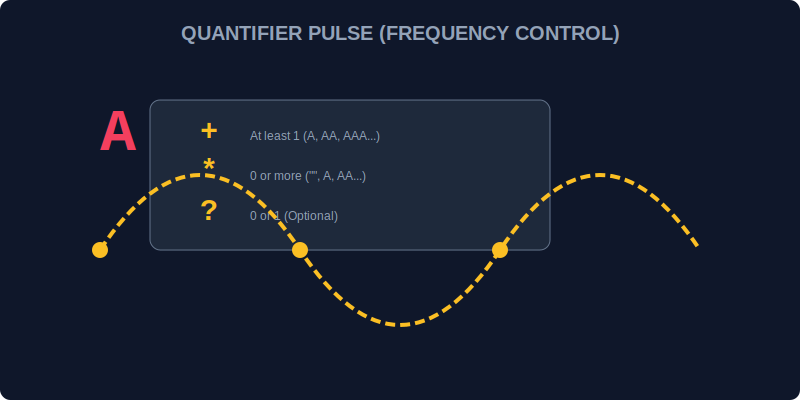

# CH-03: Quantifiers (Pulse Frequency)

> **"Beberapa tanda tangan data muncul berulang kali. Alih-alih memindai per karakter, Quantifiers adalah 'Pengatur Frekuensi' (Pulse Frequency) yang memungkinkan scanner memindai pengulangan sinyal yang sama sebanyak yang direncanakan."**

Quantifiers menentukan berapa banyak karakter atau kelompok karakter yang harus dicocokkan.

## 1. Mental Model: "Pulse Frequency"

Bayangkan pemindai radar mendeteksi sinyal listrik.
- `+`: Berhenti jika sinyal ada **setidaknya satu kali** atau lebih (1+).
- `*`: Berhenti jika sinyal ada **nol kali** atau lebih (0+).
- `?`: Berhenti jika sinyal ada **nol atau satu kali** saja (Opsional).
- `{n}`: Berhenti hanya jika sinyal muncul **tepat `n` kali**.

---

## 2. Tabel Frekuensi Scanner

| Simbol | Arti | Ekuivalen |
| :--- | :--- | :--- |
| `a*` | Nol atau lebih | `{0,}` |
| `a+` | Satu atau lebih | `{1,}` |
| `a?` | Nol atau satu (opsional) | `{0,1}` |
| `a{3}` | Tepat tiga | - |
| `a{3,}` | Tiga atau lebih | - |
| `a{2,5}` | Antara dua sampai lima | - |

---

## 3. Greedy vs Lazy (Rakus vs Malas)

Secara default, scanner bersifat **Greedy** (mengambil sebanyak mungkin yang bisa ditemukan).
- Pola `a+` pada `aaaaa` akan mengambil kelima karakter `a`.
- Pola `a+?` (tanda tanya setelah quantifier) mengubahnya menjadi **Lazy** (mengambil sesedikit mungkin). Ia hanya akan mengambil karakter `a` pertama.

---

## Arsitek Mindset: Batasi Jangkauan

Sebagai arsitek Hub:
- Gunakan `{n,m}` untuk presisi tinggi jika Anda sudah tahu rentang panjang data (misal: kode pos, ID unit).
- Hati-hati dengan `*` dan `+` karena tanpa kontrol yang tepat, mereka bisa menyebabkan scanner memindai seluruh grid data tanpa henti (*backtracking issues*).
- Gunakan perilaku **Lazy** `?` saat memproses tag HTML atau karakter pembungkus agar scanner tidak melompati penutup yang seharusnya.

---

## Hands-on: Lab Pengatur Frekuensi
Buka file `examples/pulse_freq_lab.js` untuk bereksperimen dengan berbagai pengaturan frekuensi untuk memindai data yang berulang.

---
*Status: [status.md](../../../status.md)*
