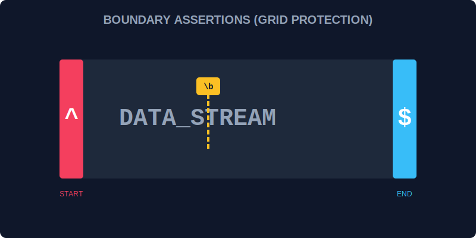

# CH-01: Assertions (Grid Boundaries)

> **"Pemindaian data yang akurat tidak hanya tentang 'apa' karakternya, tapi juga 'di mana' lokasinya. Assertions adalah 'Penjaga Batas' (Grid Boundaries) yang memastikan scanner hanya bekerja di awal, akhir, atau di sekitar pola tertentu tanpa benar-benar memakan data di batas tersebut."**

Assertions mencakup batas kata (`\b`), awal/akhir baris (`^`, `$`), serta pencarian di muka (*lookahead*) dan di belakang (*lookbehind*).

## 1. Mental Model: "Grid Boundaries"

Bayangkan grid data sebagai peta wilayah Hub.
- `^`: Scanner hanya diijinkan mencari di pintu masuk wilayah (Awal Baris).
- `$`: Scanner hanya diijinkan mencari di pintu keluar wilayah (Akhir Baris).
- `\b`: Scanner memastikan ia berada di celah antar blok data (Batas Kata).
- **Lookahead (?=...)**: "Pastikan ada koin di depan, tapi jangan ambil koinnya, cukup tahu kalau dia ada di sana."

---

## 2. Jenis Penjaga Batas

| Simbol | Deskripsi |
| :--- | :--- |
| `^` | **Start**: Awal dari input string atau baris. |
| `$` | **End**: Akhir dari input string atau baris. |
| `\b` | **Word Boundary**: Posisi antara kata dan spasi/simbol. |
| `(?=...)` | **Positive Lookahead**: Mencocokkan sesuatu hanya jika diikuti oleh pola tertentu. |
| `(?!...)` | **Negative Lookahead**: Mencocokkan sesuatu hanya jika **TIDAK** diikuti oleh pola tertentu. |

---

## 3. Kekuatan Lookarounds

Lookarounds sangat berguna untuk validasi yang kompleks tanpa menggerakkan "kursor" scanner. Misal: memastikan password mengandung angka sebelum memproses karakter berikutnya.

---

## Arsitek Mindset: Validasi Tanpa Jejak

Sebagai arsitek Hub:
- Gunakan `^` dan `$` saat memvalidasi input formulir (seperti email atau nomor telepon) untuk memastikan tidak ada data tambahan ilegal di awal atau akhir.
- Gunakan `\b` untuk mencari kata spesifik agar tidak terjebak dalam kata lain (misal: cari `the` tapi tidak menemukan `there`).
- Gunakan Lookarounds untuk logika "Must Contain" (Harus Mengandung) yang efisien.

---

## Hands-on: Lab Penjaga Batas
Buka file `examples/grid_boundaries_lab.js` untuk berlatih membatasi pergerakan scanner di titik-titik krusial Grid data.

---
*Status: [status.md](../../../status.md)*
