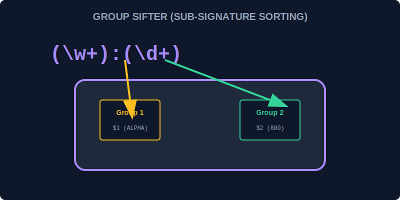

# CH-02: Groups & Ranges (Sub-Signature Sorting)

> **"Beberapa tanda tangan data memiliki struktur berlapis—seperti nama unit yang diikuti kode wilayah. Groups & Ranges adalah 'Pemilah Sub-Tanda Tangan' (Sub-Signature Sorting) yang memungkinkan scanner memilah dan mengambil bagian spesifik dari sebuah temuan utuh."**

Capturing groups `(...)` dan character ranges `[a-z]` memberikan kontrol penuh atas apa yang ingin Anda ekstrak.

## 1. Mental Model: "Sub-Signature Sorting"

Bayangkan Anda memindai sebuah paket data besar.
1. `( ... )`: **Capturing Group** adalah kotak kecil di dalam scanner. Saat scanner menemukan kecocokan, ia akan menyimpan bagian di dalam kurung tersebut ke dalam kotak terpisah agar Anda bisa mengambilnya nanti.
2. `[ ... ]`: **Range** adalah saringan yang menentukan karakter apa saja yang boleh masuk ke sensor (misal: hanya angka `0-9` atau hanya huruf kapital `A-Z`).

---

## 2. Fitur Pengelompokan

- **Capturing Groups**: `(abc)` - Menyimpan temuan untuk digunakan kembali (misal: lewat `$1` di `replace()`).
- **Non-Capturing Groups**: `(?:abc)` - Mengelompokkan karakter tapi tidak menyimpannya (untuk efisiensi).
- **Named Groups**: `(?<name>abc)` - Memberikan label pada kotak penyimpanan agar lebih mudah dibaca (ES2018+).

---

## 3. Ranges & Alternations

- `[a-z]`: Rentang karakter dari 'a' sampai 'z'.
- `[0-9A-F]`: Rentang untuk angka Hexadecimal.
- `a|b`: Alternation—pilih salah satu (OR).

---

## Arsitek Mindset: Ekstraksi Terorganisir

Sebagai arsitek Hub:
- Gunakan **Capturing Groups** jika Anda hanya butuh sebagian kecil dari sebuah string panjang (misal: ambil domain dari sebuah email).
- Berikan nama pada group (`Named Groups`) jika kode Anda akan dibaca oleh teknisi lain, agar maksud pemilahan datanya jelas.
- Gunakan `(?:...)` jika Anda hanya butuh mengelompokkan quantifier (seperti `(?:ABC)+`) tanpa perlu menyimpan hasilnya ke memori Hub.

---

## Hands-on: Lab Pemilahan Sub-Tanda Tangan
Buka file `examples/signature_sort_lab.js` untuk mencoba membedah string kompleks menjadi bagian-bagian yang terorganisir menggunakan teknik grouping.

---
*Status: [status.md](../../../status.md)*
