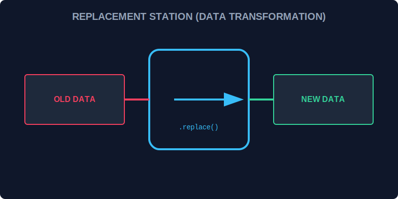

# CH-02: String Methods (Replacement Stations)

> **"Pemindaian data hanyalah separuh jalan. Hub seringkali perlu melakukan pembersihan, penggantian, atau ekstraksi massal. String Methods adalah 'Stasiun Penggantian' (Replacement Stations) yang menggunakan hasil scan untuk mengubah bentuk data secara otomatis."**

Metode string seperti `match`, `matchAll`, `search`, `split`, dan `replace` adalah "konsumen" utama dari pola RegExp Anda.

## 1. Mental Model: "Replacement Stations"

Bayangkan data mengalir masuk ke stasiun.
- **.match()**: Stasiun pengambilan. Ia mengambil semua barang yang ditandai scanner.
- **.replace()**: Stasiun modifikasi. Ia mencopot barang lama dan memasang barang baru di tempat yang sama.
- **.matchAll()**: Stasiun ekstraksi detail. Mirip `.match()` tapi memberikan detail forensik (groups) untuk setiap temuan.



---

## 2. Kekuatan Modifikasi (.replace)

`.replace()` tidak hanya mengganti teks statis, ia bisa menggunakan referensi capturing groups:
- `$1`, `$2`: Mengacu pada isi group pertama, kedua, dsb.
- `$&`: Mengacu pada seluruh bagian yang cocok.

```javascript
const date = "2026-03-19";
const reformatted = date.replace(/(\d{4})-(\d{2})-(\d{2})/, "$3/$2/$1");
// Hasil: "19/03/2026"
```

---

## 3. Ekstraksi Massal (.matchAll)

Metode ini mengembalikan sebuah `Iterator`, sangat efisien untuk memproses ribuan temuan tanpa membebani memori Hub sekaligus.

---

## Arsitek Mindset: Transformasi Data

Sebagai arsitek Hub:
- Gunakan `.replace()` dengan fungsi callback jika logika penggantian data sangat kompleks (misal: enkripsi dinamis).
- Pilih `.matchAll()` daripada `.match()` dengan flag `g` jika Anda membutuhkan akses ke Capturing Groups di setiap temuan.
- Gunakan `.split(RegExp)` jika pemisah data Anda tidak konsisten (misal: bisa spasi, koma, atau titik dua).

---

## Hands-on: Lab Stasiun Penggantian
Buka file `examples/sifting_methods_lab.js` untuk berlatih mengubah format log Grid dan menyamarkan data rahasia menggunakan kekuatan String methods.

---
*Status: [status.md](../../../status.md)*
