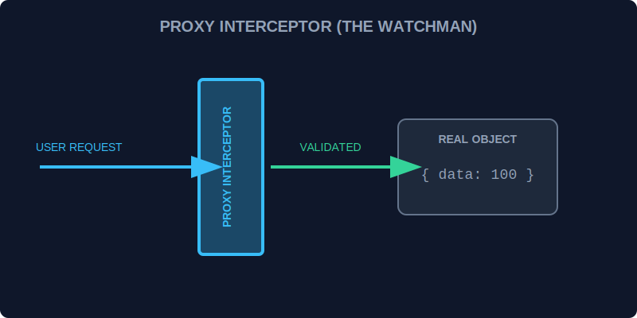

# CH-01: Proxy Basics (The Interceptor)

> **"Di dalam Hub, tidak semua akses ke unit data harus dibiarkan tanpa pengawasan. Proxy adalah 'Interseptor' (The Interceptor) yang berdiri di depan objek asli, mencegat setiap permintaan akses (get, set) untuk melakukan validasi, logging, atau modifikasi data secara real-time."**

Proxy memungkinkan Anda membuat "wrapper" untuk objek lain dan mendefinisikan perilaku kustom untuk operasi dasar.

## 1. Mental Model: "The Interceptor"

Bayangkan seorang penjaga pintu (Proxy) yang berdiri di depan ruang kontrol (Object).
- Setiap kali seseorang ingin **Membaca** data (`get`), penjaga bisa mencatat siapa yang melihatnya.
- Setiap kali seseorang ingin **Mengubah** data (`set`), penjaga bisa memeriksa apakah nilai barunya aman sebelum mengijinkannya masuk.



---

## 2. Struktur Proxy

Proxy membutuhkan dua komponen:
1.  **Target**: Objek asli yang ingin diproteksi.
2.  **Handler**: Objek berisi "traps" (perangkap) yang mendefinisikan operasi apa yang ingin dicegat.

```javascript
const target = { energy: 100 };
const handler = {
    get: (obj, prop) => {
        console.log(`[WATCHMAN] Mengakses properti: ${prop}`);
        return obj[prop];
    }
};

const proxy = new Proxy(target, handler);
console.log(proxy.energy); // [WATCHMAN] Mengakses properti: energy -> 100
```

---

## 3. Manfaat Operasional

- **Validasi Data**: Memastikan hanya angka positif yang masuk ke sistem energi.
- **Logging/Profiling**: Memantau frekuensi penggunaan data tertentu.
- **Side Effects**: Memicu peringatan otomatis jika ambang batas energi terlampaui.

---

## Arsitek Mindset: Pengawasan Tanpa Gangguan

Sebagai arsitek Hub:
- Gunakan Proxy untuk menambahkan logika tanpa harus mengubah kode di dalam objek asli (*Decoupling*).
- Hati-hati dengan performa; karena setiap akses dicegat, Proxy yang terlalu kompleks bisa memperlambat aliran data di Grid yang sangat sibuk.
- Gunakan Proxy untuk membuat objek "Read-Only" yang sangat ketat untuk konfigurasi sistem yang krusial.

---

## Hands-on: Lab Sang Interseptor
Buka file `examples/proxy_validator_lab.js` untuk membuat sistem proteksi otomatis yang mencegah data ilegal masuk ke database Hub.

---
*Status: [status.md](../../../status.md)*
