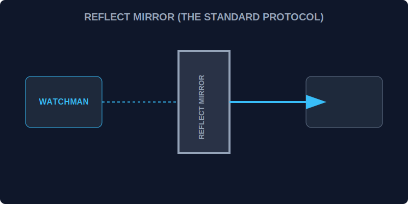

# CH-02: Reflect API (The Mirror Protocol)

> **"Jika Proxy adalah penjaga yang mencegat permintaan, maka Reflect adalah 'Protokol Cermin' (The Mirror Protocol) yang menyediakan cara standar untuk meneruskan permintaan tersebut ke objek asli tanpa merusak alur internal sistem."**

Reflect adalah objek built-in yang menyediakan metode untuk mengoperasikan objek dengan cara yang lebih teratur dan fungsional.

## 1. Mental Model: "The Mirror Protocol"

Bayangkan Proxy sebagai filter. Setelah filter menyetujui sebuah permintaan, ia harus meneruskannya ke Target.
- Menggunakan `target[prop] = value` secara manual kadang berisiko (misal: jika objek di-*freeze*).
- Menggunakan `Reflect.set(target, prop, value)` seperti menggunakan alat standar Hub yang menjamin operasi tersebut dilakukan dengan benar dan mengembalikan status sukses/gagal secara eksplisit.



---

## 2. Mengapa Menggunakan Reflect?

1.  **Pengembalian Nilai yang Jelas**: Metode Reflect mengembalikan Boolean (`true/false`) untuk operasi seperti `set` atau `deleteProperty`, memudahkannya digunakan dalam logika `if`.
2.  **Konsistensi dengan Proxy**: Setiap "Trap" yang ada di Proxy memiliki metode yang sesuai di Reflect.
3.  **Gaya Fungsional**: Mengubah operator (seperti `delete` atau `in`) menjadi pemanggilan fungsi yang bersih.

---

## 3. Contoh Sinergi Proxy + Reflect

```javascript
const handler = {
    set(target, prop, value, receiver) {
        console.log(`Mencoba set ${prop}`);
        // Meneruskan dengan Reflect
        return Reflect.set(target, prop, value, receiver);
    }
};
```

---

## Arsitek Mindset: Standarisasi Operasi

Sebagai arsitek Hub:
- Selalu gunakan `Reflect` di dalam Proxy handler Anda untuk memastikan konteks `this` tetap terjaga (melalui parameter `receiver`).
- Gunakan `Reflect.has()` daripada operator `in` jika Anda ingin kode yang lebih konsisten dalam gaya pemrograman fungsional.
- Gunakan `Reflect.apply()` untuk memanggil fungsi dengan cara yang lebih aman dan terstruktur.

---

## Hands-on: Lab Protokol Cermin
Buka file `examples/reflect_mirror_lab.js` untuk melihat bagaimana Reflect menyempurnakan cara kerja Proxy dalam menjaga integritas data.

---
*Status: [status.md](../../../status.md)*
