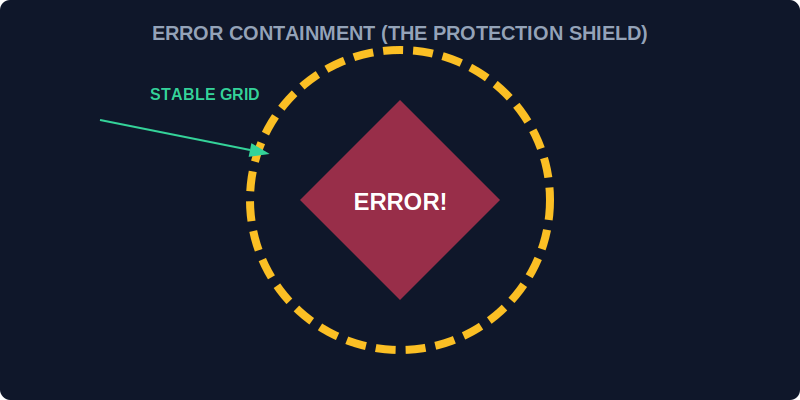

# CH-01: Advanced Errors (The Containment Box)

> **"Kabel terbakar? Kebocoran energi? Di Grid yang kompleks, kegagalan adalah kepastian. Error Handling adalah 'Kotak Kontomasi' (The Containment Box) yang memastikan ketika satu mesin meledak, ledakannya tidak merambat ke seluruh Hub."**

JavaScript menyediakan blok `try...catch...finally` dan kemampuan untuk membuat tipe Error kustom untuk klasifikasi kegagalan yang lebih presisi.

## 1. Mental Model: "The Containment Box"

Bayangkan setiap operasi krusial dijalankan di dalam ruangan bersegel.
- **try**: Ruangan tempat eksperimen/operasi dijalankan.
- **catch**: Protokol darurat yang aktif jika terjadi kegagalan (ledakan). Anda mendapatkan laporan kerusakan (`error`).
- **finally**: Tim pembersihan yang selalu datang, tidak peduli eksperimennya sukses atau gagal, untuk mematikan daya atau menutup katup.



---

## 2. Struktur Error yang Canggih

Selain menangkap error, Anda bisa membuat klasifikasi error sendiri agar sistem tahu seberapa gawat situasinya.

```javascript
class PowerOverloadError extends Error {
    constructor(amount) {
        super(`Energy Overload detected: ${amount}MW`);
        this.name = "PowerOverloadError";
        this.severity = "CRITICAL";
    }
}
```

---

## 3. Rethrowing (Melempar Kembali)

Terkadang, protokol lokal tidak bisa menangani masalah besar. Anda bisa melempar kembali (`throw`) error tersebut ke level Hub yang lebih tinggi setelah melakukan logging awal.

---

## Arsitek Mindset: Ketahanan Sistem

Sebagai arsitek Hub:
- Jangan biarkan blok `catch` kosong. Selalu operasikan protokol pemulihan atau minimal catat kegagalannya.
- Gunakan `finally` untuk melepas sumber daya (seperti menutup koneksi database atau menghapus timer) agar tidak terjadi kebocoran memori.
- Buat Custom Errors yang informatif; "Error 123" jauh kurang berguna daripada `SectorOfflineError`.

---

## Hands-on: Lab Protokol Darurat
Buka file `examples/emergency_protocols_lab.js` untuk berlatih membangun sistem keamanan yang berlapis menggunakan Custom Errors dan nested try-catch.

---
*Status: [status.md](../../../status.md)*
