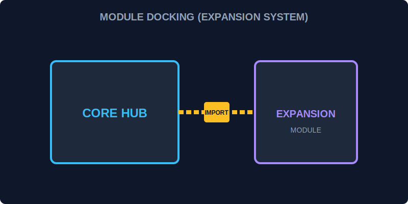

# CH-01: ES Modules (The Docking System)

> **"Web Energy Hub tidak lagi dibangun sebagai satu blok tunggal yang masif. Modules adalah 'Sistem Penambatan' (The Docking System) yang memungkinkan kita membagi Hub menjadi unit-unit terisolasi yang bisa dipasang (import) dan dilepas (export) sesuai kebutuhan."**

ES Modules (ESM) adalah standar resmi JavaScript untuk pengorganisasian kode dalam file yang berbeda.

## 1. Mental Model: "The Docking System"

Bayangkan Hub memiliki banyak dermaga (ports).
- **Export**: Mengirimkan komponen (fungsi, kelas, variabel) dari satu unit agar bisa digunakan di tempat lain.
- **Import**: Menyambungkan unit lain ke dermaga unit Anda saat ini untuk mengakses kemampuannya.
- **Default vs Named**:
    - **Default**: Satu barang utama di dermaga tersebut.
    - **Named**: Banyak paket kecil yang diberi label berbeda.



---

## 2. Sintaks Penambatan

**Unit Pengirim (Generator.js):**
```javascript
export const power = 500;
export function activate() { ... }
export default class Reactor { ... }
```

**Unit Penerima (Hub.js):**
```javascript
import Reactor, { power, activate } from './Generator.js';
```

---

## 3. Fitur Utama Modularitas

1.  **Strict Mode Otomatis**: Semua modul berjalan dalam mode ketat secara default.
2.  **Scope Terisolasi**: Variabel di dalam modul tidak mencemari Grid global.
3.  **Dynamic Import**: Mengunduh modul hanya saat dibutuhkan (`await import()`), menghemat energi awal sistem.

---

## Arsitek Mindset: Granularitas Hub

Sebagai arsitek Hub:
- Bagilah fungsi-fungsi besar menjadi modul-modul kecil agar lebih mudah diperbaiki tanpa mematikan seluruh sistem.
- Gunakan Named Exports jika modul tersebut berisi kumpulan alat utilitas.
- Gunakan Default Export untuk komponen utama dari sebuah file (seperti kelas utama).
- Manfaatkan `import.meta.url` untuk mengetahui lokasi absolut unit Anda di dalam jaringan Grid.

---

## Hands-on: Lab Sistem Penambatan
Buka folder `examples/` untuk menjalankan simulasi penyambungan modul generator ke dalam unit kontrol utama.

---
*Status: [status.md](../../../status.md)*
