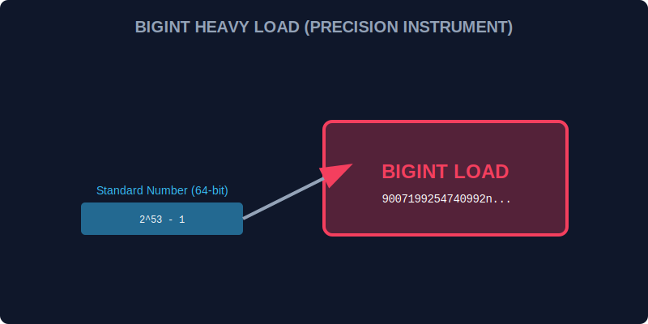

# CH-01: BigInt & Atomics (High Precision)

> **"Beberapa beban kerja di Hub melampaui angka standar 64-bit, atau membutuhkan koordinasi sinkronisasi yang sangat ketat antar pekerja Grid. BigInt & Atomics adalah 'Instrumen Presisi Tinggi' (High-Precision Instruments) untuk menangani data ekstrem dan konkurensi aman."**

JavaScript modern memperkenalkan `BigInt` untuk angka integer tak terbatas dan `Atomics` untuk operasi memori yang aman pada `SharedArrayBuffer`.

## 1. Mental Model: "High-Precision Instruments"

- **BigInt**: Seperti timbangan raksasa yang bisa menimbang beban di atas kapasitas standar Number (2^53 - 1). Berguna untuk ID transaksi finansial atau kriptografi.
- **Atomics**: Seperti lampu lalu lintas di persimpangan Grid yang sibuk. Ia memastikan bahwa jika dua pekerja (Web Workers) mencoba mengubah data di memori yang sama, mereka tidak akan bertabrakan, melainkan bergantian secara tertib.



---

## 2. Menggunakan BigInt

Anda bisa membuat BigInt dengan menambahkan akhiran `n` pada angka atau menggunakan fungsi `BigInt()`.

```javascript
const hugeAmount = 9007199254740991n; 
const oneMore = hugeAmount + 1n; // 9007199254740992n
```
*Catatan: BigInt tidak bisa dicampur langsung dengan Number biasa tanpa konversi eksplisit.*

---

## 3. Atomics & Shared Memory

`Atomics` menyediakan operasi atomik seperti `add`, `sub`, `and`, `or`, dan `load/store` yang dijamin selesai tanpa interupsi dari thread lain.

---

## Arsitek Mindset: Akurasi Ekstrem

Sebagai arsitek Hub:
- Gunakan **BigInt** hanya jika Anda benar-benar membutuhkan angka di atas 9 kuadriliun. Menggunakannya untuk perhitungan kecil hanya akan menambah overhead pemrosesan.
- Berhati-hatilah saat melakukan sinkronisasi dengan **Atomics**; kesalahan logika di sini bisa menyebabkan "Deadlock" di mana seluruh Grid berhenti menunggu satu sama lain.
- Gunakan `Atomics.wait()` dan `Atomics.notify()` untuk membangun sistem komunikasi antar pekerja yang sangat efisien dan rendah latensi.

---

## Hands-on: Lab Instrumen Presisi
Buka file `examples/precision_tools_lab.js` untuk mencoba perhitungan angka raksasa dan melihat bagaimana Atomics menjaga integritas data di memori bersama.

---
*Status: [status.md](../../../status.md)*
