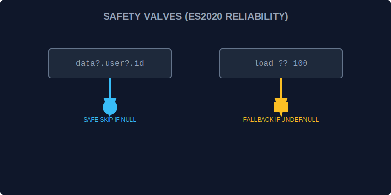

# CH-01: Safety Valves (Optional Chaining & Nullish Coalescing)

> **"Di dalam Grid yang luas, data seringkali hilang atau tidak lengkap. Optional Chaining dan Nullish Coalescing adalah 'Katup Pengaman' (Safety Valves) yang mencegah sistem Hub mengalami crash saat mencoba mengakses energi dari pipa yang kosong."**

ES2020 memperkenalkan dua operator krusial untuk menangani nilai `null` atau `undefined` dengan lebih elegan.

## 1. Mental Model: "Safety Valves"

- **Optional Chaining (`?.`)**: Seperti memeriksa apakah sebuah pipa terhubung sebelum mencoba membukanya. Jika pipa tidak ada, aliran berhenti dengan aman (mengembalikan `undefined`) alih-alih meledakkan sistem.
- **Nullish Coalescing (`??`)**: Seperti katup cadangan yang hanya terbuka jika sumber utama benar-benar kosong (`null` atau `undefined`), bukan sekadar bertekanan rendah (seperti angka `0` atau string kosong `""`).



---

## 2. Praktik di Lapangan

### Akses Data Mendalam (Optional Chaining)
```javascript
// Dulu
const temp = unit && unit.sensors && unit.sensors.temperature;

// Sekarang
const temp = unit?.sensors?.temperature;
```

### Nilai Default yang Cerdas (Nullish Coalescing)
```javascript
const load = signal.load ?? 100; 
// Jika signal.load = 0, load tetap 0 (bukan 100).
```

---

## 3. Kombinasi Maut

Kedua "katup" ini sering digunakan bersama untuk akses data yang sangat aman:
```javascript
const humidity = grid?.sector?.humidity ?? "DATA_NOT_AVAILABLE";
```

---

## Arsitek Mindset: Ketahanan Aliran Data

Sebagai arsitek Hub:
- Gunakan `?.` saat berurusan dengan API eksternal atau konfigurasi yang mungkin tidak lengkap untuk menghindari error `Cannot read property of undefined`.
- Gunakan `??` alih-alih `||` jika angka `0` atau string kosher `""` adalah nilai valid yang tidak boleh digantikan oleh default.
- Hindari penggunaan `?.` secara berlebihan pada setiap variabel; gunakan hanya pada titik-titik yang memang berpotensi kosong di dalam skema data Grid Anda.

---

## Hands-on: Lab Katup Pengaman
Buka file `examples/safety_valves_lab.js` untuk menguji ketahanan sistem saat mengakses sensor-sensor Grid yang tidak stabil.

---
*Status: [status.md](../../../status.md)*
