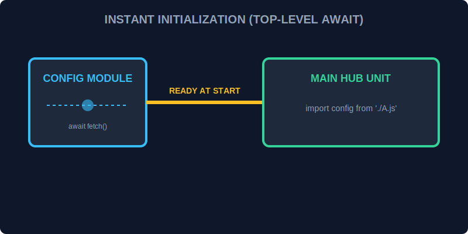

# CH-01: Top-Level Await (Instant Initialization)

> **"Dulu, Hub harus membungkus setiap modul asinkron dalam fungsi 'async' hanya untuk memulai. Sekarang, dengan Top-Level Await, sistem dapat melakukan 'Inisialisasi Instan' (Instant Initialization) langsung di level teratas modul, menyederhanakan docking antar unit."**

ES2022 memungkinkan penggunaan kata kunci `await` di luar fungsi `async` pada level teratas sebuah modul.

## 1. Mental Model: "Instant Initialization"

Bayangkan unit cadangan energi yang butuh memuat data konfigurasi dari penyimpanan pusat sebelum bisa aktif.
- **Dulu**: Anda harus membuat fungsi pembungkus seperti `async function init() { ... }` dan memanggilnya. Ini sering menyebabkan masalah urutan pemuatan (*race condition*).
- **Sekarang**: Modul tersebut bisa langsung memanggil `await fetchConfig()`. Modul lain yang melakukan `import` akan menunggu secara otomatis sampai konfigurasi tersebut selesai dimuat sebelum melanjutkannya.



---

## 2. Praktik di Lapangan

```javascript
/* Di dalam DatabaseConnector.mjs */
const connection = await connectToGrid(); // Tunggu koneksi stabil
export { connection };

/* Di dalam HubApp.mjs */
import { connection } from './DatabaseConnector.mjs';
// connection sudah pasti siap digunakan di sini!
```

---

## 3. Manfaat Operasional

- **Resource Loading**: Memuat model AI atau dataset besar sebelum mengekspor fungsi.
- **Dynamic Imports**: Memilih modul mana yang akan dimuat berdasarkan kondisi lingkungan saat startup.
- **Dependency Awareness**: Menjamin urutan eksekusi yang benar antar modul asinkron.

---

## Arsitek Mindset: Startup yang Terkendali

Sebagai arsitek Hub:
- Gunakan Top-Level Await untuk inisialisasi yang *memang harus* selesai sebelum Hub mulai melayani permintaan.
- Hati-hati: Jika pengunduhan data sangat lambat, ini akan menahan pemuatan semua modul lain yang bergantung padanya. Pertimbangkan untuk memberikan batas waktu (timeout) pada operasi `await` di level teratas.
- Gunakan fitur ini di dalam file `.mjs` atau di dalam project dengan `"type": "module"` pada `package.json`.

---

## Hands-on: Lab Inisialisasi Instan
Buka folder `examples/` untuk mencoba bagaimana Top-Level Await mempermudah penambatan data asinkron antar unit Hub.

---
*Status: [status.md](../../../status.md)*
