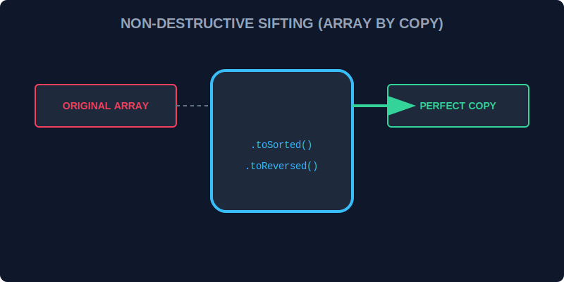

# CH-01: Change Array by Copy (Non-Destructive Sifting)

> **"Di dalam Hub yang sibuk, mengubah data asli bisa sangat berbahaya bagi unit lain yang sedang membacanya. Change Array by Copy adalah 'Saringan Non-Destruktif' (Non-Destructive Sifting) yang memungkinkan Anda memilah data dan mendapatkan hasil baru tanpa merusak susunan data asli di Grid."**

ES2023 memperkenalkan metode-metode baru yang mengembalikan salinan array alih-alih mengubah array aslinya (*in-place*).

## 1. Mental Model: "Non-Destructive Sifting"

- **Metode Lama (`sort`, `reverse`, `splice`)**: Seperti mengubah susunan kabel di panel pusat. Jika Anda salah, semua orang yang terhubung ke panel itu akan terkena dampaknya.
- **Metode Baru (`toSorted`, `toReversed`, `toSpliced`, `with`)**: Seperti memotret panel tersebut, lalu mengatur ulang susunan kabel di dalam foto (salinan). Panel aslinya tetap aman dan tidak tersentuh.



---

## 2. Senjata Baru di Grid

1.  **`.toSorted()`**: Mengembalikan array yang terurut.
2.  **`.toReversed()`**: Mengembalikan array dengan urutan terbalik.
3.  **`.toSpliced(start, deleteCount, ...items)`**: Mengembalikan array dengan bagian yang telah dipotong/ditambah.
4.  **`.with(index, value)`**: Mengembalikan array baru dengan satu elemen di posisi tertentu yang telah diubah (Sangat berguna untuk pembaruan state yang imutabel).

---

## 3. Contoh Penggunaan Aman

```javascript
const signals = ["LOW", "HIGH", "MEDIUM"];

// Tidak mengubah 'signals' asli
const sortedSignals = signals.toSorted(); 

console.log(signals); // ["LOW", "HIGH", "MEDIUM"] (Tetap Aman)
console.log(sortedSignals); // ["HIGH", "LOW", "MEDIUM"] (Terurut)
```

---

## Arsitek Mindset: Integritas Data

Sebagai arsitek Hub:
- Prioritaskan metode `to...` jika Anda bekerja dengan arsitektur berbasis State (seperti React) atau jika Hub Anda memiliki banyak pembaca data secara konkuren.
- Gunakan `.with()` untuk melakukan pembaruan satu titik data tanpa harus melakukan *spread operator* `[...array]` yang panjang.
- Menggunakan metode non-destruktif mempermudah proses *debugging* karena Anda selalu bisa melacak jejak data asli sebelum diolah.

---

## Hands-on: Lab Saringan Aman
Buka file `examples/non_destructive_lab.js` untuk membandingkan bahaya metode lama dengan keamanan metode `toSorted` dan `with`.

---
*Status: [status.md](../../../status.md)*
