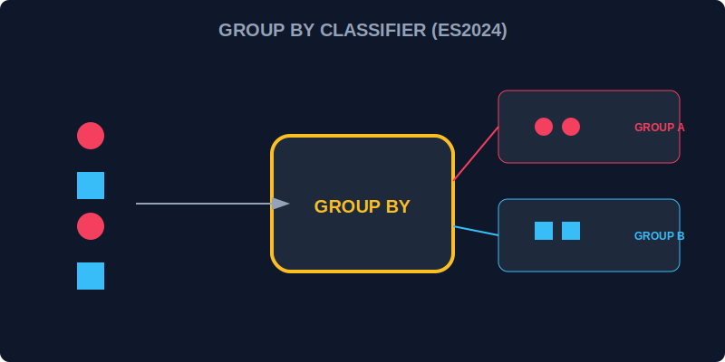

# CH-02: Object Grouping (Energy Classification)

> **"Data yang berceceran di Grid sulit dianalisis. Object Grouping adalah 'Pengklasifikasi Energi' (Energy Classifier) yang secara otomatis mengumpulkan unit-unit data ke dalam boks kategori yang tepat tanpa perlu algoritma manual yang rumit."**

ES2024 memperkenalkan `Object.groupBy()` dan `Map.groupBy()` sebagai cara standar untuk mengelompokkan elemen koleksi berdasarkan kriteria tertentu.

## 1. Mental Model: "Energy Classifier"

Bayangkan tumpukan sensor dari berbagai sektor (Alpha, Beta, Gamma) masuk ke pengolah data.
- **Dulu**: Anda harus membuat loop `forEach`, menyiapkan objek kosong, mengecek apakah kategori sudah ada, lalu melakukan `.push()`.
- **Sekarang**: Anda cukup memberikan daftar sensor dan instruksi ("Kelompokkan berdasarkan sektor"), dan mesin Classifier akan memberikan hasilnya seketika.



---

## 2. Cara Kerja Classifier

```javascript
const drones = [
  { id: 1, type: "flying" },
  { id: 2, type: "crawling" },
  { id: 3, type: "flying" }
];

const grouped = Object.groupBy(drones, (d) => d.type);
/* Hasil: 
{ 
  flying: [{id: 1, ...}, {id: 3, ...}], 
  crawling: [{id: 2, ...}] 
} 
*/
```

---

## 3. Map.groupBy()

Sama seperti `Object.groupBy`, namun mengembalikan sebuah `Map`. Sangat berguna jika kriteria pengelompokan Anda berupa objek atau jika Anda butuh fitur performa tinggi dari Map.

---

## Arsitek Mindset: Organisasi Otomatis

Sebagai arsitek Hub:
- Gunakan `Object.groupBy` untuk visualisasi data atau laporan akhir yang butuh dikonsumsi oleh UI Hub.
- Gunakan `Map.groupBy` jika data tersebut akan diolah kembali secara intensif atau jika Anda butuh kunci pengelompokan yang kompleks.
- Fitur ini sangat mengurangi jumlah kode (*boilerplate*) dan memperkecil kemungkinan bug pada logika pengelompokan manual.

---

## Hands-on: Lab Klasifikasi Energi
Buka file `examples/energy_grouping_lab.js` untuk mencoba pengelompokan inventaris Hub berdasarkan level urgensi secara otomatis.

---
*Status: [status.md](../../../status.md)*
