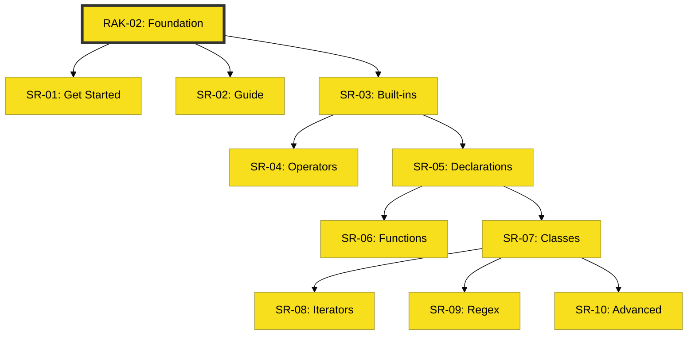

# RAK-02: JavaScript Foundation

> **"Mastering the Syntax Fuel: Bangun Fondasi, Gapai Ekosistem."**

---

## 🔗 Source Hub
- **Primary Source**: [MDN Web Docs - JavaScript Guide](https://developer.mozilla.org/en-US/docs/Web/JavaScript/Guide)
- **Technical Reference**: [ECMA-262 - Overview](https://tc39.es/ecma262/#sec-overview)
- **Strategic Parent**: [Blueprint: JavaScript Hub](../../../learning-matrix-blueprint/01-Language-Hubs/JavaScript-Knowledge-Base.md)

---

## 🌓 1. Essence: The Narrative
RAK-02 adalah "Bahan Bakar Sintaks" (Syntax Fuel) dari seluruh perjalanan Anda. Di sini, kita tidak hanya belajar bagaimana menulis kode yang jalan, tapi bagaimana menulis kode yang **benar secara arsitektural**. Kita membedah bagaimana JavaScript mengelola data, memproses logika, dan menjaga modularitas melalui fungsi dan objek.

Fondasi yang kuat di RAK-02 adalah jaminan bagi Anda untuk memahami dekonstruksi spesifikasi yang jauh lebih berat di **RAK-04**.

---

## 🗺️ 2. Landscape: The Big Picture
RAK-02 dibagi menjadi 10 Track spesifik yang mencakup seluruh spektrum dasar bahasa:

### 🎨 Visual Logic: The Foundation Map

### 🏛️ Sub-Rak (Tracks)
1.  **[SR-01: Get Started](./SR-01-get-started/)**: Langkah pertama di dunia JavaScript.
2.  **[SR-02: JS Guide](./SR-02-js-guide/)**: Panduan komprehensif fitur bahasa.
3.  **[SR-03: Built-ins](./SR-03-built-ins/)**: Objek bawaan (Array, String, Object, dll).
4.  **[SR-04: Expressions & Operators](./SR-04-expressions-operators/)**: Katup manipulasi energi dan bitwise.
5.  **[SR-05: Statements & Declarations](./SR-05-statements-declarations/)**: Infrastruktur logika dan alokasi memori.
6.  **[SR-06: Functions](./SR-06-functions/)**: Unit operasi dan jantung modularitas.
7.  **[SR-07: Classes](./SR-07-classes/)**: Blueprint struktural dan evolusi objek.
8.  **[SR-08: Iterators & Generators](./SR-08-iterators-generators/)**: Protokol pengulangan dan aliran data sekuensial.
9.  **[SR-09: Regular Expressions](./SR-09-regular-expressions/)**: Pemrosesan teks dan pemindaian pola tingkat lanjut.
10. **[SR-10: Advanced Topics](./SR-10-advanced/)**: Meta-programming, Atomics, dan ES Modules.

---

## 🧪 3. The Lab (Syntax Proof)
Setiap unit di RAK-02 dilengkapi dengan folder `examples/` yang berisi pembuktian kode. Gunakan lab ini untuk memverifikasi perilaku sintaks sebelum menerapkannya di proyek nyata.

---

## ⚠️ 4. Common Pitfalls & Myths
- **Mitos**: "Saya sudah tahu sintaks, jadi saya tidak butuh RAK-02." (Faktanya, banyak bug "aneh" di level senior terjadi karena pemahaman Scope dan Hoisting yang dangkal di level fondasi).
- **Mitos**: "Standard Built-ins (Array/Object) cukup dipelajari secara permukaan." (Faktanya, memahami optimasi internal di SR-03 akan menyelamatkan performa aplikasi Anda).

---
*Status: [/] Partial. Sedang dalam tahap restrukturisasi menuju Adaptive Gold Standard.*
