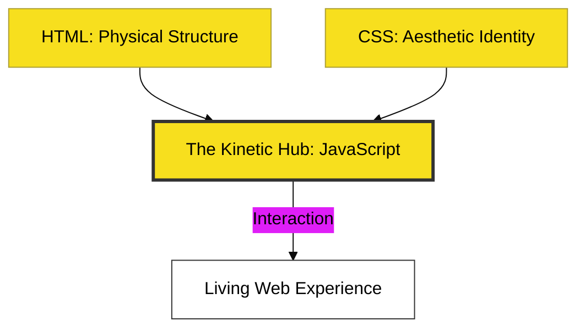

# CH-01: The Kinetic Orientation

> **"JavaScript adalah Hub Kinetik yang mengubah dokumen statis menjadi pengalaman hidup."**

---

## 🔗 Source Hub
- **Primary Source**: [MDN Web Docs - What is JavaScript?](https://developer.mozilla.org/en-US/docs/Learn/JavaScript/First_steps/What_is_JavaScript)
- **Conceptual Guide**: [The Web Platform Architecture](https://developer.mozilla.org/en-US/docs/Learn/Getting_started_with_the_web)
- **Conceptual Parent**: [BK-01 JS First Steps](../README.md)

---

## 🌓 1. Essence: The Logic
Sebelum menulis kode pertama, Anda harus memahami posisi JavaScript dalam ekosistem web. JavaScript bertindak sebagai **Energi Kinetik**—arus listrik yang mengalir di antara struktur fisik (HTML) dan estetika (CSS). Ia merespons kejadian (*events*), mengubah tampilan secara *real-time*, dan berkomunikasi dengan dunia luar.

Di era modern, JavaScript bukan lagi sekadar bahasa untuk animasi tombol; ia adalah **Bahasa Universal** yang menggerakkan Browser, Server (Node.js), hingga Robotika.

---

## 🎨 2. Visual Logic: The Web Energy Stack
Hubungan antara tiga pilar utama web:

---

## 🏛️ 3. Sections Atlas
- **[SEC-01: Web Introduction](./SEC-01_IntroductionToTheWebEnergy/)**: Membedah posisi JavaScript sebagai energi penggerak dan model mental arsitektur web modern.

---

## 🧪 4. The Lab (Orientation Lab)
Buka file laboratorium untuk melihat aksi pertama JavaScript terhadap data:
- `../examples/energy_demo.js`

---

## ⚠️ 5. Common Pitfalls & Myths
- **Mitos**: *"JavaScript sama dengan Java."* (Sama sekali bukan; keduanya memiliki filosofi arsitektur dan mekanisme pengisian daya yang berbeda).
- **Mitos**: *"Gunakan JavaScript untuk semua interaksi."* (Sebagai arsitek, jangan gunakan JS untuk hal yang bisa diselesaikan CSS (misal: hover sederhana). Gunakan JS untuk **Logika dan Transformasi Data**).

---
*Back to [JS First Steps](../README.md)*
