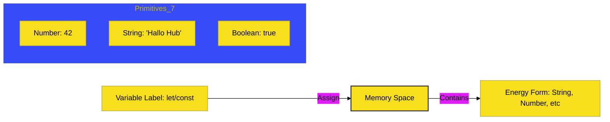

# CH-02: Grammar & Storage

> **"Baterai Berlabel: Mengatur Alokasi Memori dan Bentuk Energi Dasar."**

---

## 🔗 Source Hub
- **Primary Source**: [MDN Web Docs - JavaScript data types and variables](https://developer.mozilla.org/en-US/docs/Web/JavaScript/Data_structures)
- **Technical Reference**: [ECMA-262 - Lexical Declarations](https://tc39.es/ecma262/#sec-let-and-const-declarations)
- **Conceptual Parent**: [BK-01 JS First Steps](../README.md)

---

## 🌓 1. Essence: The Logic
Jika JavaScript adalah energi kinetik, maka **Variables** adalah baterai tempat kita menyimpannya, dan **Data Types** adalah bentuk energi yang menentukan bagaimana hub memprosesnya. 

- **Deklarasi (`const` & `let`)**: Memesan ruang memori dan memberi label pada baterai.
- **Primitives**: 7 tipe data dasar (String, Number, Boolean, dll) yang bersifat atomik dan tidak bisa diubah (*immutable*).

---

## 🎨 2. Visual Logic: Memory Storage Mechanism
Mekanisme pengolahan dan pelabelan energi di memori:

---

## 🏛️ 3. Sections Atlas
- **[SEC-01: Variables](./SEC-01_Variables/)**: Membedah teknik deklarasi baterai menggunakan `const` (stabil) dan `let` (isi ulang).
- **[SEC-02: Data Types](./SEC-01_DataTypes/)**: Membedah 7 bentuk energi dasar (Primitives) dan pemaian pemindai `typeof`.

---

## 🧪 4. The Lab (Storage Lab)
Uji ketangkasan pelabelan dan pemindaian energi di laboratorium:
- `../examples/storage_demo.js`
- `../examples/types_demo.js`

---

## ⚠️ 5. Common Pitfalls & Myths
- **Mitos**: *"Gunakan `var` untuk fleksibilitas."* (Sebagai arsitek, **HINDARI VAR.** Gunakan `const` untuk keamanan atau `let` jika nilai memang harus berubah).
- **Mitos**: *"JavaScript sama dengan Java dalam hal tipe data."* (Sama sekali bukan; JavaScript menggunakan **Dynamic Typing**, yang berarti "bentuk energi" di dalam baterai bisa berubah sewaktu-waktu).

---
*Back to [JS First Steps](../README.md)*
