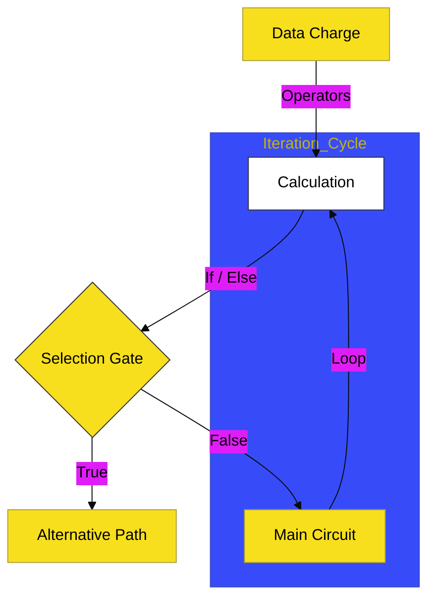

# CH-03: Logic & Circuitry

> **"Sirkuit Logika: Mengatur Aliran Data dan Pengambilan Keputusan Hub."**

---

## 🔗 Source Hub
- **Primary Source**: [MDN Web Docs - Control Flow](https://developer.mozilla.org/en-US/docs/Web/JavaScript/Guide/Control_flow_and_error_handling)
- **Technical Reference**: [ECMA-262 - Statements and Declarations](https://tc39.es/ecma262/#sec-statements)
- **Conceptual Parent**: [BK-01 JS First Steps](../README.md)

---

## 🌓 1. Essence: The Logic
Data tidak pernah statis; ia harus diproses dan diarahkan. **CH-03** membedah bagaimana kita menggunakan **Operators** sebagai katup, **Logical Gates** sebagai pemeriksa integritas, dan **Control Flow** sebagai percabangan jalur sirkuit.

- **Arithmetic & Logical**: Transformasi dan pembandingan energi data.
- **Conditionals (If/Else)**: Penentuan jalur selektif berdasarkan sinyal status.
- **Loops (For/While)**: Sirkulasi energi yang berulang untuk pemrosesan massal.

---

## 🎨 2. Visual Logic: The Logic Flow & Cycle
Mekanisme pemrosesan dan perulangan aliran data:

---

## 🏛️ 3. Sections Atlas
- **[SEC-01: Arithmetic](./SEC-01_BasicOperationsEnergyFlow/)**: Kalkulasi dasar yang mentransformasi nilai data.
- **[SEC-02: Logic Gates](./SEC-01_LogicalGatesLogicFlow/)**: Pintu gerbang perbandingan dan penggabungan sinyal logika.
- **[SEC-03: Conditionals](./SEC-01_ConditionalsMultiPathCircuit/)**: Peta percabangan sirkuit untuk pengambilan keputusan.
- **[SEC-04: Loops](./SEC-01_LoopsEnergyCycle/)**: Siklus energi untuk pemrosesan data yang berulang.

---

## 🧪 4. The Lab (Circuit Lab)
Uji ketajaman logika dan siklus perulangan Anda di laboratorium:
- `../examples/logic_lab.js`
- `../examples/loop_demo.js`

---

## ⚠️ 5. Common Pitfalls & Myths
- **Mitos**: *"Looping selalu lebih baik."* (Hati-hati dengan **Infinite Loops**, sirkuit yang tidak pernah berhenti akan membekukan seluruh Hub aplikasi Anda).
- **Mitos**: *"Short-circuit logic (`&&`) hanyalah trik koding."* (Sebaliknya, ini adalah efisiensi energi Hub yang menghentikan pengecekan lebih awal jika hasil sudah jelas).

---
*Back to [JS First Steps](../README.md)*
