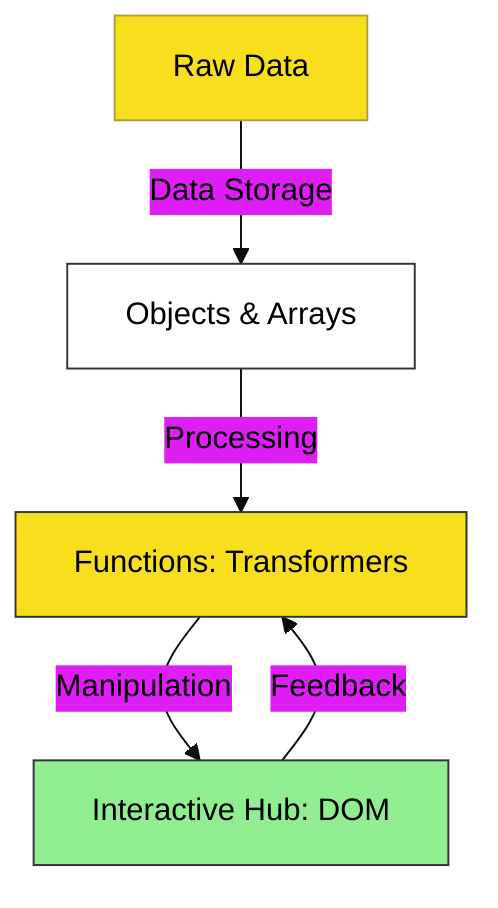

# CH-04: Specialized Units

> **"Unit Spesialis: Dari Transformator Fungsi hingga Struktur Data Kompleks."**

---

## 🔗 Source Hub
- **Primary Source**: [MDN Web Docs - Functions Guide](https://developer.mozilla.org/en-US/docs/Web/JavaScript/Guide/Functions)
- **Technical Reference**: [MDN Web Docs - DOM Introduction](https://developer.mozilla.org/en-US/docs/Web/API/Document_Object_Model/Introduction)
- **Conceptual Parent**: [BK-01 JS First Steps](../README.md)

---

## 🌓 1. Essence: The Logic
Selamat datang di tingkat perakitan unit. Di **CH-04**, kita tidak lagi hanya memproses data mentah, melainkan membangun **Unit Spesialis** yang memiliki fungsi dan struktur data sendiri:

- **Functions**: Transformator energi yang menerima masukan dan menghasilkan luaran secara mandiri.
- **Arrays & Objects**: Wadah penyimpanan terstruktur untuk mengorganisir ribuan data.
- **Interactive Hub (DOM)**: Jembatan di mana kode JavaScript Anda akhirnya menyentuh dan menggerakkan elemen fisik halaman web.

---

## 🎨 2. Visual Logic: The Unit Architectural Blueprint
Mekanisme interaksi antara unit fungsi, struktur data, dan ekosistem tampilan:

---

## 🏛️ 3. Sections Atlas
- **[SEC-01: Functions](./SEC-01_FunctionsEnergyTransformers/)**: Transformator logika mandiri untuk tugas-tugas spesifik.
- **[SEC-02: Data Structures](./SEC-01_ComplexSystemsObjectsArrays/)**: Mengelola ribuan energi data menggunakan Objects dan Arrays.
- **[SEC-03: DOM Intro](./SEC-01_InteractiveHubBrowserInteraction/)**: Jembatan interaksi pertama antara JavaScript dan halaman web.

---

## 🧪 4. The Lab (Unit Lab)
Uji ketajaman perakitan unit dan manipulasi tampilan di laboratorium:
- `../examples/function_demo.js`
- `../examples/interactive_hub.html`

---

## ⚠️ 5. Common Pitfalls & Myths
- **Mitos**: *"Functions harus sangat panjang agar terlihat hebat."* (Sebaliknya, arsitek profesional menyukai fungsi yang **kecil, satu tujuan, dan murni** agar mudah diuji).
- **Mitos**: *"DOM adalah bagian dari bahasa JavaScript."* (Salah, DOM adalah **Web API** yang disediakan browser; JavaScript hanyalah instrumen yang digunakan untuk memanipulasinya secara dinamis).

---
*Back to [JS First Steps](../README.md)*
