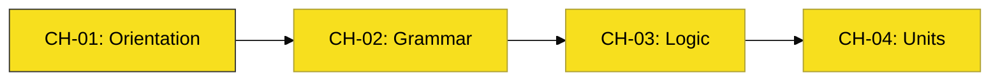

# BK-01: JS First Steps

> **"Langkah Pertama: Dari Filosofi Energi ke Perakitan Unit Logika Dasar."**

---

## 🔗 Source Hub
- **Primary Source**: [MDN Web Docs - JavaScript First Steps](https://developer.mozilla.org/en-US/docs/Learn/JavaScript/First_steps)
- **Conceptual Parent**: [SR-01 Get Started](../README.md)

---

## 🌓 1. Essence: The Narrative
Buku ini dirancang untuk memberikan orientasi filosofis dan teknis bagi pemula. Kita tidak hanya belajar "apa" itu JavaScript, tapi "bagaimana" ia menghidupkan web melalui aliran energi data yang terukur. Dalam 4 bab inti, Anda akan dibawa dari pemahaman ekosistem web hingga mampu merakit unit fungsi dan struktur data kompleks yang interaktif.

---

## 🗺️ 2. Landscape: The Onboarding Chapters
Buku ini memetakan 4 langkah awal penguasaan bahasa:

### 🎨 Visual Logic: The Lean Roadmap

### 🏛️ Chapters Atlas
1.  **[CH-01: The Kinetic Orientation](./CH-01_KineticOrientation/)**: Memahami filosofi JavaScript sebagai energi kinetik dalam arsitektur web.
2.  **[CH-02: Grammar & Storage](./CH-02_GrammarStorage/)**: Mengatur alokasi memori (let/const) dan mengenal 7 bentuk energi dasar (Primitives).
3.  **[CH-03: Logic & Circuitry](./CH-03_LogicCircuitry/)**: Membedah sirkuit logika, perbandingan, dan siklus perulangan data.
4.  **[CH-04: Specialized Units](./CH-04_SpecializedUnits/)**: Perakitan unit transformator (Functions) dan pengenalan interaksi hub interaktif (DOM).

---

## 🧪 3. The Lab (First Lab)
Gunakan folder `examples/` di setiap Bab untuk memulai eksperimen pertama Anda di sirkuit JavaScript.

---

## ⚠️ 4. Common Pitfalls & Myths
- **Mitos**: *"Belajar JavaScript itu sulit."* (Faktanya, dengan kurikulum arsitektural di BK-01, Anda akan memahami JavaScript bukan sebagai deretan kode, tapi sebagai sistem energi yang logis).
- **Mitos**: *"JavaScript hanya untuk animasi."* (JavaScript adalah bahasa pemrograman lengkap yang menggerakkan logika aplikasi di sisi klien maupun server).

---
*Status: [x] Complete. Arsitektur 10 Bab telah dikonsolidasi menjadi 4 Bab Inti.*
