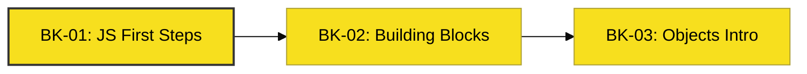

# SR-01: Get Started

> **"Pintu Masuk: Dari nol hingga menulis energi pertama Anda."**

---

## 🔗 Source Hub
- **Primary Source**: [MDN Web Docs - Learn JavaScript](https://developer.mozilla.org/en-US/docs/Learn/JavaScript)
- **Technical Reference**: [ECMA-262 - Overview](https://tc39.es/ecma262/#sec-overview)
- **Conceptual Parent**: [RAK-02 Foundation](../README.md)

---

## 🌓 1. Essence: The Narrative
Selamat datang di pusat aktivasi energi. **SR-01** dirancang untuk membawa Anda dari tahap pengamatan luar hingga mampu menyentuh sintaks JavaScript secara langsung. Di sini, Anda akan belajar bagaimana memberikan instruksi dasar kepada Hub, memahami bangunan dasar logika, dan mengenal konsep objek sebagai entitas utama di JavaScript.

---

## 🗺️ 2. Landscape: The Big Picture
Sub-Rak ini memetakan 3 langkah awal dalam penguasaan bahasa:

### 🎨 Visual Logic: The Onboarding Flow

### 🏛️ Books Atlas
1.  **[BK-01: JS First Steps](./BK-01_JSFirstSteps/)**: Fondasi energi dasar dan sejarah singkat sintaks (Terkonsolidasi dalam 4 Bab Inti).
2.  **[BK-02: Building Blocks](./BK-02_BuildingBlocks/)**: Logika alur (conditionals & loops) untuk arsitektur sirkuit.
3.  **[BK-03: Introducing Objects](./BK-03_IntroducingObjects/)**: Konsep awal objek sebagai wadah data.

---

## 🧪 3. The Lab (Onboarding Lab)
Buka folder `examples/` di setiap Bab untuk menulis baris kode pertama Anda dan memverifikasi bagaimana JavaScript beraksi terhadap data.

---

## ⚠️ 4. Common Pitfalls & Myths
- **Mitos**: *"Belajar JavaScript harus langsung ke framework."* (Faktanya, tanpa memahami langkah-langkah di SR-01, Anda akan kesulitan saat debugging logika dasar).
- **Mitos**: *"JavaScript sama dengan Java."* (Sama sekali bukan, keduanya memiliki filosofi dan arsitektur pengisian daya yang berbeda).

---
*Status: [x] Complete. Struktur Hub Onboarding telah diselaraskan.*
