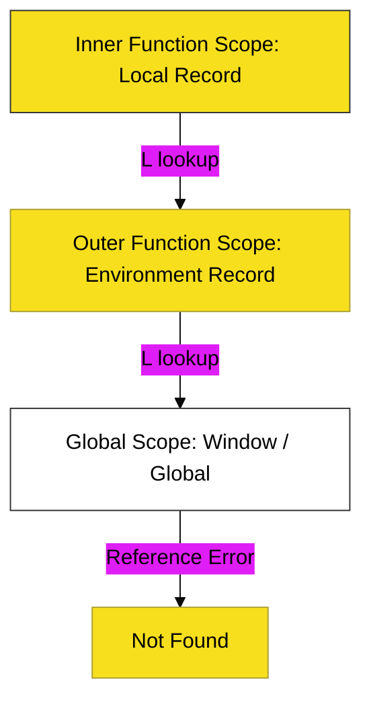

# CH-01: Advanced Flow & Scope

> **"Cakupan & Visibilitas: Mengatur Aliran Data di Dalam Hierarki Memori."**

---

## 🔗 Source Hub
- **Primary Source**: [MDN Web Docs - Scope](https://developer.mozilla.org/en-US/docs/Glossary/Scope)
- **Technical Reference**: [ECMA-262 - Lexical Environments](https://tc39.es/ecma262/#sec-lexical-environments)
- **Conceptual Parent**: [BK-01 Core Mechanics](../README.md)

---

## 🌓 1. Essence: The Logic
Dalam arsitektur JavaScript, data tidak bisa diakses secara sembarangan. **Scope** (Cakupan) adalah kumpulan aturan yang menentukan di mana sebuah variabel bisa ditemukan dan digunakan. Pemahaman mendalam tentang **Lexical Scope** memungkinkan Anda mengontrol keamanan data dan mencegah konflik penamaan di dalam Hub aplikasi yang besar.

Di tingkat lanjut, kita mempelajari bagaimana **Execution Context** dibangun dan bagaimana **Scope Chain** memungkinkan sebuah fungsi mencari data hingga ke level Global.

---

## 🎨 2. Visual Logic: The Scope Chain Flow
Mekanisme pencarian variabel melalui hierarki cakupan (Scoping):

---

## 🏛️ 3. Sections Atlas
- **[SEC-01: Execution Context](./SEC-01_ExecutionContext/)**: Membedah fase pembuatan (*Creation Phase*) dan eksekusi (*Execution Phase*) unit kode.
- **[SEC-02: Lexical Environments](./SEC-02_LexicalEnvironments/)**: Peta struktur data internal yang menyimpan identitas variabel dan referensi cakupan luar.

---

## 🧪 4. The Lab (Scope Lab)
Buktikan perilaku *Shadowing* dan *Scope Chain* melalui laboratorium interaktif:
- `../examples/scope_chain_demo.js`

---

## ⚠️ 5. Common Pitfalls & Myths
- **Mitos**: *"Scope ditentukan saat kode dijalankan."* (Salah, JavaScript menggunakan **Lexical Scoping**, yang berarti cakupan ditentukan saat kode ditulis/diparsing berdasarkan posisi fisiknya).
- **Mitos**: *"Variabel global selalu aman digunakan."* (Sangat berbahaya; membanjiri Global Scope dapat menyebabkan tabrakan data (*Namespace Pollution*) yang sangat sulit di-debug di dalam Hub).

---
*Back to [Core Mechanics](../README.md)*
