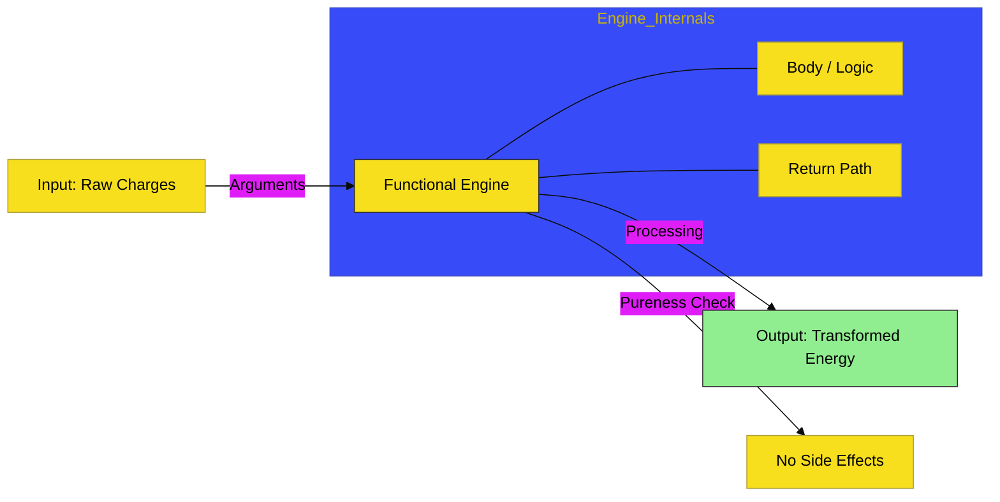

# CH-02: The Functional Engine

> **"Mesin Fungsional: Transformasi Data Menjadi Energi yang Terarah."**

---

## 🔗 Source Hub
- **Primary Source**: [MDN Web Docs - Functions Guide](https://developer.mozilla.org/en-US/docs/Web/JavaScript/Guide/Functions)
- **Technical Reference**: [ECMA-262 - Function Definitions](https://tc39.es/ecma262/#sec-function-definitions)
- **Conceptual Parent**: [BK-01 Core Mechanics](../README.md)

---

## 🌓 1. Essence: The Logic
Fungsi di JavaScript bukan sekadar kumpulan kode; ia adalah **Unit Transformasi Data**. Di **CH-02**, kita membedah bagaimana fungsi menerima masukan (*arguments*), memprosesnya di dalam lingkup internalnya, dan mengembalikan hasil (*return value*).

Pemahaman mendalam tentang **Pure Functions**, **Higher-Order Functions**, dan bagaimana **this** bekerja secara fungsional memungkinkan Anda membangun mesin aplikasi yang tangguh, mudah diuji (*testable*), dan bebas dari kebocoran status variabel yang tidak diinginkan (*Side Effects*).

---

## 🎨 2. Visual Logic: The Functional Transformer
Mekanisme pengolahan data melalui unit fungsi:

---

## 🏛️ 3. Sections Atlas
- **[SEC-01: Function Definitions](./SEC-01_FunctionDefinitions/)**: Meninjau cara mendeklarasikan unit transformator (Declarations vs Expressions).
- **[SEC-02: Scope & Closures](./SEC-02_ScopeClosures/)**: Peta memori internal yang memungkinkan fungsi mengingat lingkup tempat ia diciptakan.
- **[SEC-03: The 'this' Context](./SEC-03_ThisContext/)**: Menjelaskan bagaimana konteks pemanggilan menentukan "siapa" yang menjalankan mesin.

---

## 🧪 4. The Lab (Functional Lab)
Uji ketajaman pemrosesan unit fungsi dan perilaku *Closures* melalui laboratorium di:
- `../examples/functional_engine_demo.js`

---

## ⚠️ 5. Common Pitfalls & Myths
- **Mitos**: *"Fungsi yang panjang adalah fungsi yang kuat."* (Sebaliknya, arsitek profesional merancang fungsi yang **kecil dan satu tujuan** (*Single Responsibility*) agar sirkuit aplikasi tetap bersih).
- **Mitos**: *"Arrow Functions hanyalah pemendek tulisan."* (Faktanya, Arrow Functions memiliki perilaku **this** yang berbeda secara leksikal, yang sangat berguna untuk me-main-tain konteks di dalam Hub yang kompleks).

---
*Back to [Core Mechanics](../README.md)*
