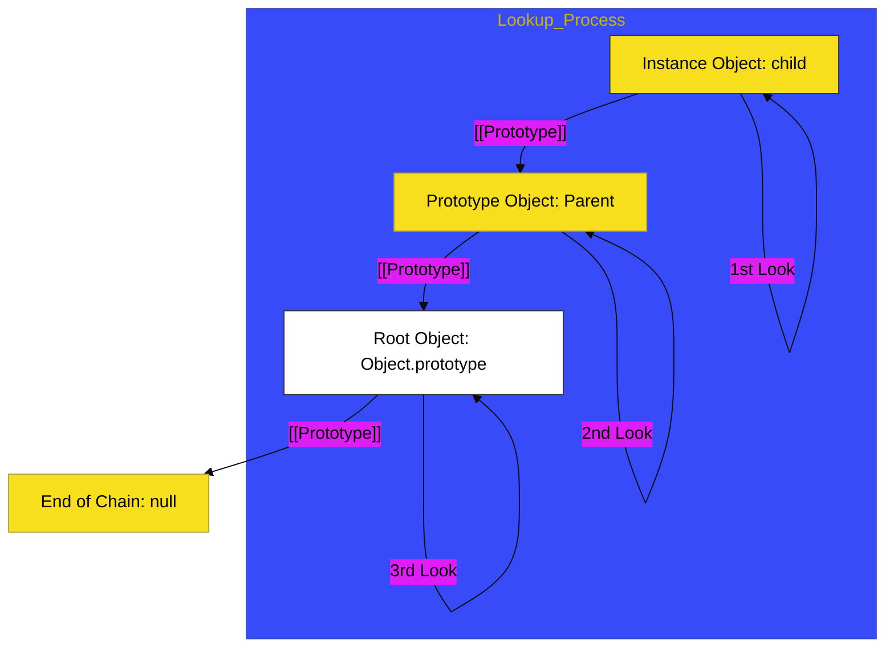

# CH-03: Object Mastery

> **"Masteri Objek: Delegasi Prototipe dan Arsitektur Data yang Terorganisir."**

---

## 🔗 Source Hub
- **Primary Source**: [MDN Web Docs - Inheritence and the Prototype Chain](https://developer.mozilla.org/en-US/docs/Web/JavaScript/Inheritance_and_the_prototype_chain)
- **Technical Reference**: [ECMA-262 - Ordinary Object Internal Methods and Slots](https://tc39.es/ecma262/#sec-ordinary-object-internal-methods-and-internal-slots)
- **Conceptual Parent**: [BK-01 Core Mechanics](../README.md)

---

## 🌓 1. Essence: The Logic
Objek di JavaScript bukan sekadar wadah untuk menyimpan data; ia adalah entitas yang bisa mewarisi sifat dan kemampuan dari objek lain melalui mekanisme **Prototypal Inheritance**. Di **CH-03**, kita membedah bagaimana objek-objek saling terhubung dalam sebuah rantai (**Prototype Chain**).

Memahami bagaimana **Prototype Delegation** bekerja memungkinkan Anda membangun struktur data yang efisien, di mana ribuan objek dapat berbagi metode yang sama tanpa harus menduplikasi kode di setiap unit, sehingga menghemat konsumsi memori Hub aplikasi Anda.

---

## 🎨 2. Visual Logic: The Prototypal Delegation Path
Mekanisme delegasi dan pencarian properti melalui rantai prototipe:

---

## 🏛️ 3. Sections Atlas
- **[SEC-01: Prototypal Inheritance](./SEC-01_PrototypalInheritance/)**: Membedah mekanisme delegasi dan bagaimana objek mewarisi kemampuan dari prototipenya.
- **[SEC-02: Object Methods](./SEC-02_ObjectMethods/)**: Meninjau instrumen manipulasi objek tingkat lanjut (Keys, Values, Entries).
- **[SEC-03: Prototypes Internal](./SEC-03_PrototypesInternal/)**: Menjelaskan struktur internal `__proto__` dan properti `prototype`.

---

## 🧪 4. The Lab (Object Lab)
Uji ketajaman delegasi dan perilaku *Property Shadowing* melalui laboratorium di:
- `../examples/prototype_delegation_demo.js`

---

## ⚠️ 5. Common Pitfalls & Myths
- **Mitos**: *"JavaScript memiliki kelas seperti Java atau C++."* (Salah, secara teknis JavaScript menggunakan **Prototypal Inheritance**, bukan *Class-based Inheritance*. Kelas di JS hanyalah *Syntax Sugar* di atas prototipe).
- **Mitos**: *"Mengubah prototipe dasar (misal: `Object.prototype`) adalah praktik yang baik."* (Sangat berbahaya; memodifikasi prototipe bawaan dapat merusak integritas seluruh Hub aplikasi dan menyebabkan konflik yang mustahil di-debug).

---
*Back to [Core Mechanics](../README.md)*
