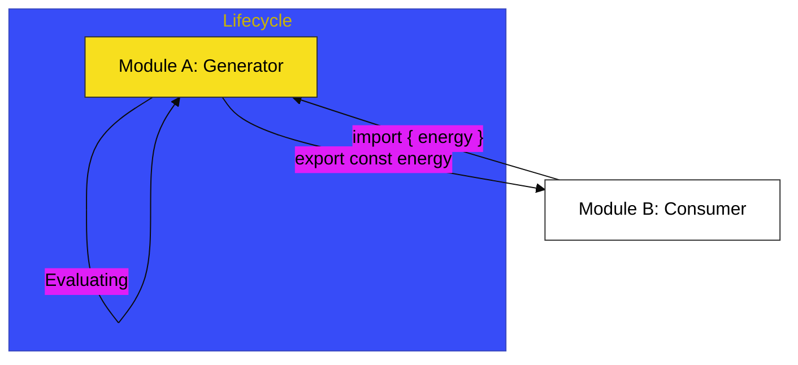

# CH-01: Modular Architecture

> **"Arsitektur Modular: Isolasi dan Distribusi Unit Kode di Ekosistem Modern."**

---

## 🔗 Source Hub
- **Primary Source**: [MDN Web Docs - JavaScript modules](https://developer.mozilla.org/en-US/docs/Web/JavaScript/Guide/Modules)
- **Technical Reference**: [ECMA-262 - Modules](https://tc39.es/ecma262/#sec-modules)
- **Conceptual Parent**: [BK-02 ES Modules](../README.md)

---

## 🌓 1. Essence: The Logic
Dalam arsitektur aplikasi yang besar, menjaga agar semua kode tidak saling bertubrukan adalah tantangan utama. **ES Modules** (ESM) adalah solusi standar JavaScript untuk membagi kode menjadi unit-unit kecil yang terisolasi (**Modules**). Setiap modul memiliki lingkupnya sendiri, dan hanya data yang secara eksplisit **di-export** yang bisa digunakan oleh modul lain.

Memahami alur **Import & Export** memungkinkan Anda membangun sistem yang modular, mudah dipelihara, dan mendukung fitur modern seperti *Tree Shaking* (penghapusan kode yang tidak terpakai secara otomatis oleh bundler).

---

## 🎨 2. Visual Logic: The Import/Export Lifecycle
Mekanisme siklus hidup modul dari deklarasi hingga konsumsi:

---

## 🏛️ 3. Sections Atlas
- **[SEC-01: ESM Concepts](./SEC-01_ESMConcepts/)**: Membedah teknik ekspor default dan bernama (*named exports*).
- **[SEC-02: Isolated Units](./SEC-02_IsolatedUnits/)**: Meninjau bagaimana cakupan modul melindungi variabel internal agar tidak bocor ke luar.

---

## 🧪 4. The Lab (Modular Lab)
Uji ketajaman distribusi dan isolasi unit kode melalui laboratorium di:
- `../examples/modular_architecture_demo.js`

---

## ⚠️ 5. Common Pitfalls & Myths
- **Mitos**: *"ES Modules sama dengan CommonJS (`require`)."* (Salah, ES Modules bersifat statis, sedangkan CommonJS dinamis. ESM dievaluasi sebelum kode dijalankan, memungkinkan optimasi performa yang lebih baik).
- **Mitos**: *"Semua variabel di dalam modul otomatis menjadi global."* (Sama sekali tidak; secara default, semua yang ada di dalam modul bersifat **Top-Level Scope** yang terisolasi; Anda harus meng-export jika ingin berbagi data).

---
*Back to [ES Modules](../README.md)*
