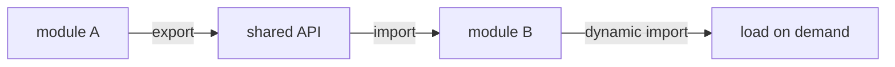

# SEC-01: ES Modules (The Inter-Hub Relays)

> **"Web Energy Hub tidak lagi dibangun sebagai satu blok tunggal yang masif. Modules adalah 'Relai Antar-Hub' (The Inter-Hub Relays) yang memungkinkan kita membagi sistem menjadi unit-unit terisolasi yang bisa dipasang (`import`) dan dilepas (`export`) melintasi jaringan Grid dengan aman."**

**ES Modules (ESM)** adalah standar resmi JavaScript untuk pengorganisasian kode. Berbeda dengan skrip tradisional, modul memiliki scope terisolasi dan mendukung pemuatan yang lebih terstruktur.

## Source Hub
- [MDN Web Docs - JavaScript modules](https://developer.mozilla.org/en-US/docs/Web/JavaScript/Guide/Modules)
- [MDN Web Docs - import](https://developer.mozilla.org/en-US/docs/Web/JavaScript/Reference/Statements/import)
- [MDN Web Docs - export](https://developer.mozilla.org/en-US/docs/Web/JavaScript/Reference/Statements/export)

---

## 1. Mental Model: "The Inter-Hub Relays"

Bayangkan setiap file `.mjs` adalah satelit Hub independen:
- **`export`**: Mengirimkan fungsi, kelas, atau nilai agar bisa dipakai satelit lain.
- **`import`**: Menangkap transmisi dari modul lain untuk memperkuat kemampuan satelit sendiri.
- **Static vs Dynamic**:
  - **Static (`import ...`)**: Sambungan permanen yang dipasang sebelum modul aktif.
  - **Dynamic (`import()`)**: Sambungan yang dipasang saat dibutuhkan.
- **Top-Level Await**: Modul bisa menunggu data tertentu sebelum melanjutkan inisialisasi.




---

## 2. Protokol Transmisi

### A. Named vs Default Relays
| Tipe | Pengirim (`export`) | Penerima (`import`) |
| :--- | :--- | :--- |
| **Named** | `export const unit = 1;` | `import { unit } from './hub.js';` |
| **Default** | `export default class {}` | `import MainUnit from './hub.js';` |

### B. Dynamic Logistics (`import()`)
Berguna untuk *code splitting*, yaitu memuat modul hanya saat pengguna menekan tombol atau mencapai kondisi tertentu di Grid.

```javascript
if (emergency) {
    const { activateProtocol } = await import('./Safety.js');
    activateProtocol();
}
```

---

## 3. Metadata Satelit (`import.meta`)

Setiap modul memiliki akses ke objek `import.meta`, yang berisi informasi tentang lokasi modul tersebut.

```javascript
console.log("Lokasi Satelit:", import.meta.url);
```

---

## Arsitek Mindset: Granularitas Hub

Sebagai arsitek Hub:
- **Encapsulation**: Gunakan modul untuk membatasi apa yang benar-benar diekspor keluar.
- **Lazy Loading**: Dynamic import cocok untuk fitur berat yang jarang dipakai.
- **Operational Awareness**: Pahami lingkungan eksekusi modul Anda, termasuk aturan server dan file path.

---

## Hands-on: Lab Sistem Relai
Simulasikan penyambungan antar unit satelit menggunakan static dan dynamic import di `examples/docking_unit_lab.mjs`.

---
*Status: [status.md](../../../status.md)*
