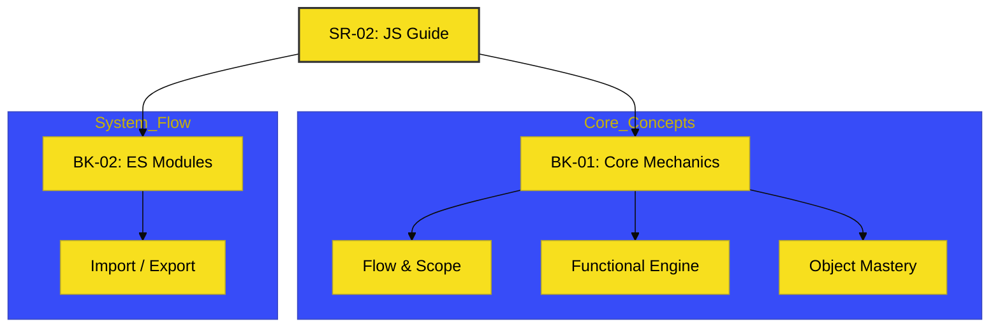

# SR-02: JS Guide

> **"Jembatan Mekanik: Menghubungkan titik-titik logika di balik layar."**

---

## 🔗 Source Hub
- **Primary Source**: [MDN Web Docs - JavaScript Guide](https://developer.mozilla.org/en-US/docs/Web/JavaScript/Guide)
- **Technical Reference**: [ECMA-262 - ECMAScript Language Specification](https://tc39.es/ecma262/)
- **Conceptual Parent**: [RAK-02 Foundation](../README.md)

---

## 🌓 1. Essence: The Narrative
Selamat datang di **Pusat Kontrol Menengah**. Di sini, kita tidak lagi hanya menyambungkan kabel, melainkan mempelajari bagaimana aliran energi (logika) dikelola secara presisi di balik layar. **SR-02** berfungsi sebagai **Bridge Layer** (Lapisan Jembatan) yang merangkum hubungan antar mekanika inti JavaScript sebelum Anda masuk ke pendalaman yang lebih spesifik di rak-rak berikutnya.

Fokus utama di sini adalah membangun **Model Mental** yang utuh tentang bagaimana memori, fungsi, dan objek bekerja sebagai satu kesatuan mesin yang sinkron.

---

## 🗺️ 2. Landscape: The Big Picture
Sub-Rak ini memetakan mekanisme inti melalui satu buku sentral:

### 🎨 Visual Logic: The Bridge Map

### 🏛️ Books Atlas
1.  **[BK-01: Core Mechanics](./BK-01_CoreMechanics/)**: Jantung mesin JavaScript yang merangkum kaitan antara Hoisting, Scope, dan Prototypes sebagai unit logika utama.
2.  **[BK-02: ES Modules](./BK-02_ESModules/)**: Membedah sistem modul standar untuk modularitas dan distribusi kode di ekosistem modern.

---

## 🧪 3. The Lab (Guide Lab)
Gunakan folder `examples/` untuk memverifikasi bagaimana konsep-konsep menengah ini berinteraksi satu sama lain dalam skenario aplikasi nyata.

---

## ⚠️ 4. Common Pitfalls & Myths
- **Mitos**: *"Belajar Guide saja sudah cukup untuk jadi senior."* (Faktanya, SR-02 hanyalah jembatan; pendalaman teknis sesungguhnya ada di SR-05 s/d SR-10 dan RAK-04).
- **Mitos**: *"Materi di sini tumpang tindih dengan rak lain."* (Faktanya, SR-02 dirancang khusus untuk orientasi konseptual, bukan untuk pembahasan detail spesifikasi yang mendalam).

---
*Status: [x] Complete. Struktur Bridge Layer telah diselaraskan.*
