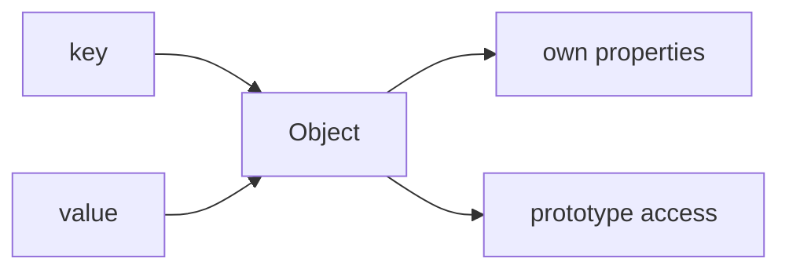

# SEC-01: Object Structure (The Master Container)

> **"`Object` adalah wadah dasar pasangan key-value di JavaScript. Banyak fitur lain berdiri di atas fondasi ini."**

## Source Hub
- [MDN Web Docs - Object](https://developer.mozilla.org/en-US/docs/Web/JavaScript/Reference/Global_Objects/Object)
- [MDN Web Docs - Working with objects](https://developer.mozilla.org/en-US/docs/Web/JavaScript/Guide/Working_with_objects)

## Formal Definition
`Object` adalah struktur dasar JavaScript untuk menyimpan properti dengan kunci dan nilai.

## Mental Model
Bayangkan `Object` sebagai gudang induk tempat data disusun dalam rak-rak bernama.

## Mekanisme Praktis
- Kunci biasanya string atau symbol.
- Nilai bisa berupa data biasa, fungsi, atau objek lain.
- Objek yang dibuat umumnya tetap terhubung ke `Object.prototype`.

## Arsitek Mindset
- Gunakan objek untuk struktur data sederhana yang mudah dipahami.
- Jangan ubah `Object.prototype` secara global.

## Lab Praktis
Lihat eksplorasi properti dasar di [object_deep_dive.js](../examples/object_deep_dive.js).

---
*Status: [status.md](../../../status.md)*
